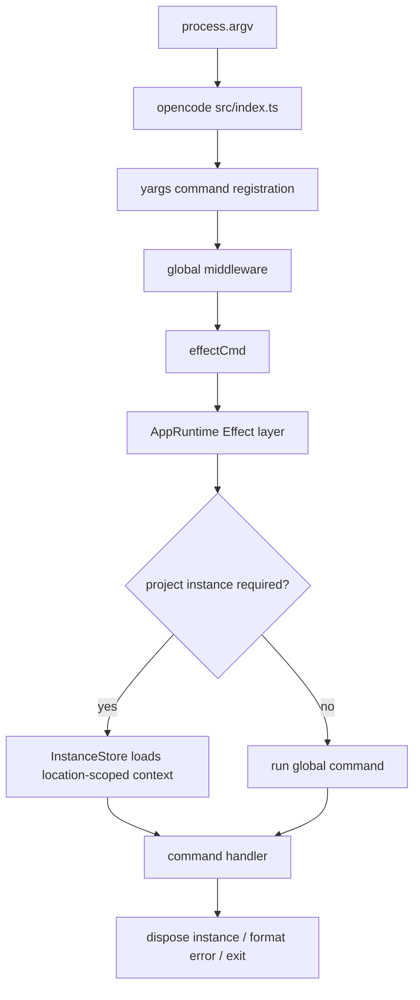
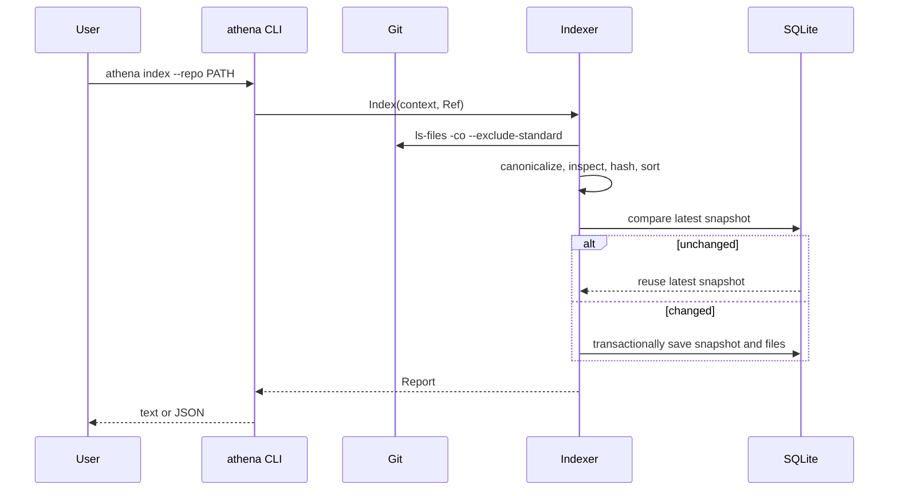
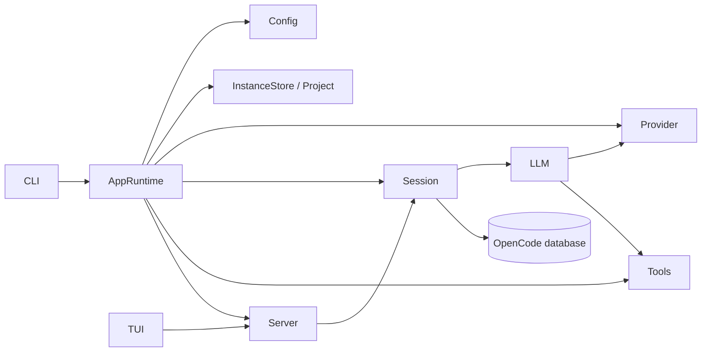
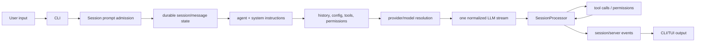
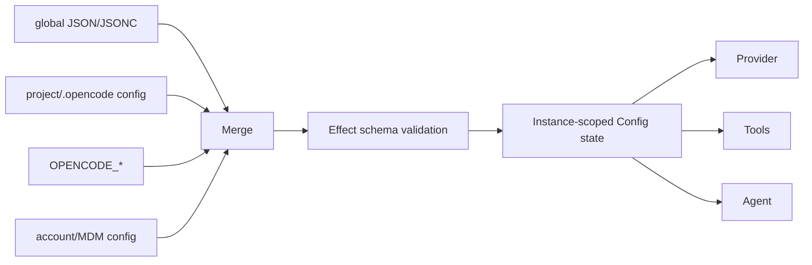
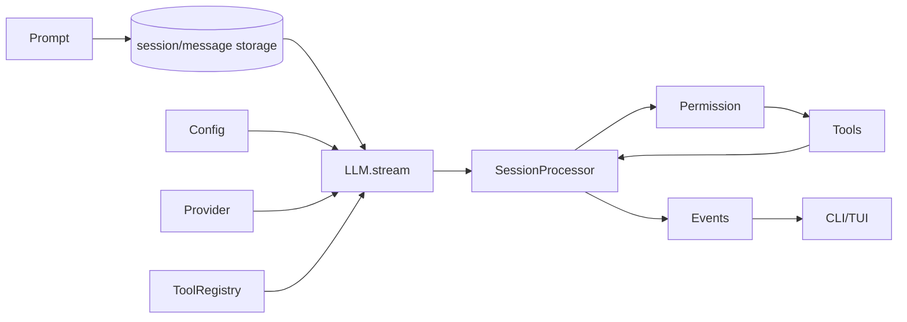
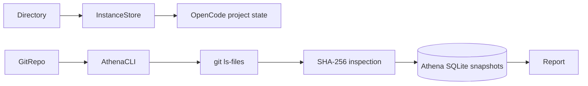
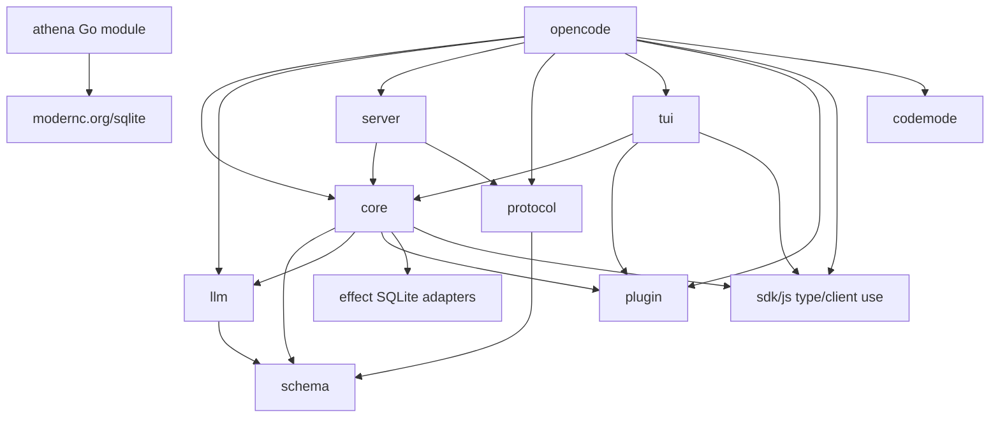
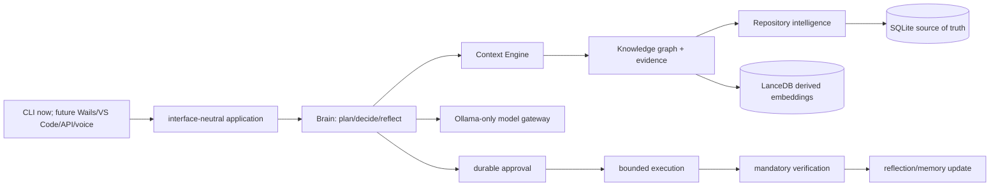

# Athena Engineering Context

**Status:** living repository handbook.  
**Evidence cut-off:** working tree inspected on 2026-08-05.  
**Scope:** repository contents and locally executed validation only. Facts are cited as repository paths (and, where useful, symbols or line ranges). Anything not supported by that evidence is marked **unknown**.

## 1. Executive Summary

This repository is a Bun/TypeScript monorepo named `athena-cli-foundation` whose active runtime package is still OpenCode. Its root manifest describes it as a “CLI-only foundation extracted from OpenCode”; `packages/opencode/src/index.ts` registers the CLI and composes the application runtime. The repository also now contains a separate Go module at `athena/`, which is the beginning of the Athena Engineering Brain. [Evidence: `package.json`, `packages/opencode/src/index.ts`, `athena/go.mod`]

OpenCode currently provides command parsing, configuration, local state, providers, sessions, tools, streaming, terminal rendering, a local HTTP server, plugins, Git integration, and an SDK. Athena currently provides exactly one production-tested capability: read-only, Git-aware repository inventory with deterministic SHA-256 file snapshots persisted in SQLite. It does not yet provide AST parsing, a knowledge graph, a context engine, Brain planning, Athena execution, verification orchestration, desktop UI, VS Code extension, LanceDB, or Ollama integration. [Evidence: `README.md`, `athena/repository/indexer.go`, `docs/athena/index.md`]

The runtime architecture is service-oriented TypeScript using Effect layers. `AppRuntime` composes configuration, auth, storage, providers, agents, sessions, LLM streaming, tools, project state, and related services. Project-specific state is location/directory scoped through `InstanceStore`. The new Athena architecture deliberately keeps its Go core independent so that future CLI, desktop, editor, API, and voice adapters do not own reasoning or side effects. [Evidence: `packages/opencode/src/effect/app-runtime.ts`, `packages/opencode/src/project/instance-store.ts`, `docs/athena/architecture.md`]

Primary technologies currently present are Bun 1.3.14, TypeScript, Effect, SQLite/Drizzle adapters, OpenTUI/Solid terminal rendering, AI SDK provider packages, MCP, and a new Go 1.26.5 module using `modernc.org/sqlite`. The repository contains source references to network-capable provider, account, model-catalog, remote-config, web-fetch, and web-search systems; it is therefore **not currently cloud-free**. A static search found no `ollama` identifier in `packages/opencode/src`, so OpenCode’s current source does not document a native Ollama integration. [Evidence: `package.json`, `packages/opencode/package.json`, `athena/go.mod`, `packages/core/src/models-dev.ts`, `packages/opencode/src/config/config.ts`, `packages/opencode/src/tool/webfetch.ts`]

## 2. Repository Overview

### Directory tree

```text
.
├── athena/                         Go module; first Athena capability
│   ├── cmd/athena/                 CLI adapter
│   └── repository/                 Git-aware hash index and SQLite store
├── athena-migration/               Historical cleanup/migration reports
├── docs/athena/                    Athena architecture dossiers and review
├── packages/
│   ├── opencode/                   Current CLI composition root and runtime
│   ├── core/                       Shared durable/runtime primitives
│   ├── llm/                        Normalized LLM routes/protocols
│   ├── tui/                        OpenTUI/Solid terminal UI
│   ├── server/                     HTTP server package
│   ├── protocol/                   Shared HTTP API contracts
│   ├── schema/                     Cross-package schema contracts
│   ├── plugin/                     Plugin contracts
│   ├── sdk/js/                     JavaScript SDK/client
│   ├── codemode/                   Code-mode tool runtime
│   ├── effect-drizzle-sqlite/      SQLite Drizzle adapter
│   ├── effect-sqlite-node/         Node SQLite adapter
│   └── script/                     Build metadata helper
├── patches/                        Dependency patches required by Bun install
├── script/                         Repository scripts
├── README.md                       Human-facing CLI and migration guide
├── ATHENA_CONTEXT.md               This document
├── package.json                    Bun workspace root
└── turbo.json                      Turborepo task configuration
```

### Entry points

| Entry point | Role | Evidence |
| --- | --- | --- |
| `packages/opencode/src/index.ts` | Registers yargs commands, global flags, help/version, middleware, error handling, and process exit | `packages/opencode/src/index.ts:1-135` |
| `packages/opencode/bin/opencode` | Locates and launches the platform binary package | `packages/opencode/bin/opencode` |
| `packages/opencode/script/build.ts` | Generates models data, compiles the current platform binary, and smoke-tests `--version` | `packages/opencode/script/build.ts` |
| `athena/cmd/athena/main.go` | Athena Go CLI; currently supports `athena index` | `athena/cmd/athena/main.go` |
| `packages/opencode/src/server/server.ts` | Programmatic local HTTP listener | `packages/opencode/src/server/server.ts` |

### Repository statistics

At inspection, the repository contained **1,340 non-`node_modules` files** and **199,893 lines** across TypeScript/TSX/Go files. The largest source areas by line count were `packages/opencode` (80,507), `packages/core` (32,934), `packages/sdk/js` (30,143), and `packages/tui` (27,004). The Athena Go module had 640 Go lines at the same measurement. Counts are informative rather than a complexity score. [Evidence: repository file/line-count command executed during this inspection]

## 3. Technology Stack

| Area | Current verified technology | Notes and evidence |
| --- | --- | --- |
| Primary runtime | TypeScript ESM on Bun 1.3.14 | `package.json` |
| CLI parsing | yargs | `packages/opencode/src/index.ts`, `packages/opencode/package.json` |
| Effect system | `effect` 4.0.0-beta.83 | root catalog; `app-runtime.ts` |
| Terminal UI | OpenTUI, Solid, OpenTUI keymap | root catalog; `packages/tui/package.json` |
| HTTP/API | Effect HTTP/HttpApi, Node HTTP | `packages/opencode/src/server/server.ts`, `packages/protocol` |
| LLM transport | Vercel AI SDK, local `@opencode-ai/llm`, many provider SDKs | `packages/opencode/package.json`, `packages/opencode/src/session/llm.ts` |
| Storage | SQLite-related Effect/Drizzle packages and OpenCode database service | `packages/core/package.json`, `packages/effect-*`, `packages/core/src/database/database.ts` |
| Plugins/MCP | `@opencode-ai/plugin`, MCP SDK | `packages/plugin`, `packages/opencode/package.json` |
| Build/task tooling | Bun, Turborepo, TypeScript native preview, package patches | `package.json`, `turbo.json`, `patches/` |
| Athena core | Go 1.26.5; `modernc.org/sqlite` | `athena/go.mod` |
| Athena vector store | **not implemented** | No LanceDB dependency in `athena/go.mod` |
| Athena local model gateway | **not implemented** | No Ollama source reference under `packages/opencode/src`; no Go Ollama package |
| Tests | TypeScript root test script deliberately exits 1; Go has real repository index tests | `package.json`, `athena/repository/indexer_test.go` |

External services are configuration- and feature-dependent. Verified source references include models.dev fetching, provider SDKs, remote “well-known” config, account/console config, GitHub/GitLab integrations, MCP, web fetch/search, and mDNS. The repository does not contain enough evidence to state which services are enabled in a particular deployment. [Evidence: `packages/core/src/models-dev.ts`, `packages/opencode/src/config/config.ts`, `packages/opencode/src/cli/cmd/providers.ts`, `packages/opencode/src/tool/websearch.ts`]

## 4. Startup Flow

### OpenCode CLI

1. `packages/opencode/src/index.ts` obtains CLI arguments with `hideBin(process.argv)`.
2. It constructs yargs, registers global options (`--print-logs`, `--log-level`, `--pure`), command modules, help, and version.
3. Middleware sets process flags, starts heap tracking, and records agent/process environment metadata.
4. A command using `effectCmd` starts `AppRuntime`; project-bound commands acquire an `InstanceContext` through `InstanceStore`.
5. The instance bootstrap causes configuration, project, plugins, storage, provider, tool, session, and related services to be available through Effect layers.
6. The command runs, disposes any loaded instance in `finally`, and `index.ts` formats errors before explicit process exit.



### Athena CLI

The current Athena CLI is intentionally smaller. `main` creates a signal-cancelled context, dispatches `index`, opens a SQLite database, constructs `repository.NewIndexer`, and emits text or JSON. The indexer uses `git ls-files -co --exclude-standard -z`, evaluates each Git-visible file, and persists a hash snapshot. [Evidence: `athena/cmd/athena/main.go`, `athena/repository/indexer.go`, `athena/repository/sqlite.go`]



## 5. Runtime Architecture

### OpenCode major systems

| System | Responsibility | Lifecycle/state evidence |
| --- | --- | --- |
| `AppRuntime` | Builds the global Effect dependency graph | `packages/opencode/src/effect/app-runtime.ts` |
| `InstanceStore` | Coalesces directory-scoped loads, boots, reloads, and disposes project instances | `packages/opencode/src/project/instance-store.ts` |
| `Config` | Loads, merges, validates, caches, and invalidates configuration | `packages/opencode/src/config/config.ts` |
| `Provider`/`LLM` | Resolves provider/model/auth and emits normalized LLM streams | `packages/opencode/src/provider/provider.ts`, `packages/opencode/src/session/llm.ts` |
| `Session`/`SessionProcessor` | Persists sessions/messages and processes model/tool stream events | `packages/opencode/src/session/session.ts`, `packages/opencode/src/session/processor.ts` |
| `ToolRegistry`/`Permission` | Resolves built-in/custom/MCP tools and checks/replies to permissions | `packages/opencode/src/tool/registry.ts`, `packages/opencode/src/permission/index.ts` |
| `Server` | Serves local HTTP routes, websocket tracking, mDNS, shutdown | `packages/opencode/src/server/server.ts` |
| `TUI` | Terminal visual and interaction layer | `packages/tui`, `packages/opencode/src/cli/tui` |

`AppRuntime` is process-global and uses `ManagedRuntime`; it provides Effect services from a `LayerNode.group`. `InstanceStore` keeps a `Map` keyed by resolved directory and uses deferred values plus scoped fibers to coalesce concurrent loads. Its `disposeAll` is installed as a scope finalizer. This is concrete concurrency evidence; broader concurrency guarantees are **unknown** without exhaustive runtime tests. [Evidence: `packages/opencode/src/effect/app-runtime.ts`, `packages/opencode/src/project/instance-store.ts`]



### Athena target boundary

Athena’s intended dependency rule is documented, not fully implemented: domain records are dependency-free; repository intelligence, knowledge, context, Brain, execution, and verification communicate through narrow contracts; UI adapters depend on application contracts; execution only accepts approved plans. [Evidence: `docs/athena/architecture.md`, `docs/athena/01-repository-intelligence.md` through `07-user-interfaces.md`]

## 6. Package Inventory

The table records every workspace package and the Go Athena module. “Public API” means the observed exported package/module surface, not an exhaustive symbol list. “Safe to remove” is conservative: dynamic plugins/providers and generated/runtime entrypoints make static absence insufficient proof.

| Package | Purpose and responsibilities | Internal workspace dependencies | Main dependents | Public/internal API evidence | Criticality / safe to modify / remove |
| --- | --- | --- | --- | --- | --- |
| `opencode` | CLI composition root, commands, session/provider/tool/server integration | core, llm, plugin, protocol, schema, script, sdk, server, tui, codemode | binary/build artifact | `src/index.ts`; commands and Effect services | Critical; modify only with CLI/runtime tests; not safe to remove |
| `core` | Shared durable models, DB, filesystem, Git, config primitives, provider/model support, Effect infrastructure | schema, llm, plugin, sdk, SQLite adapters | opencode, server, tui | root exported modules; `Global`, `Database`, `LayerNode` | Critical; changes have broad fan-out; not safe to remove |
| `llm` | Provider-neutral request/routes/protocols/stream normalization | schema | core, opencode | `src/route`, `src/protocols`, `src/index.ts` | Critical for model turns; modify with provider-stream tests; not safe to remove |
| `tui` | OpenTUI/Solid terminal rendering and interaction | core, plugin, sdk | opencode | terminal/editor/audio exports | High; UI-facing; not safe to remove while interactive CLI remains |
| `server` | Local HTTP API service package | core, protocol | opencode | `src/api.ts`, routes/handlers | High; needed by local server/client paths; not safe to remove |
| `protocol` | HTTP/API schemas and errors | schema | opencode, server | `src/api.ts`, `src/errors.ts` | High contract package; safe to modify only with generation/compatibility review; not safe to remove |
| `schema` | Cross-package event, session, project, model, workspace schemas | none | core, llm, protocol, opencode | root schema modules | Critical foundational contract; not safe to remove |
| `plugin` | Plugin, shell, tool, TUI contracts | sdk | core, opencode, tui | `src/index.ts`, `src/tool.ts`, `src/tui.ts` | High/dynamic; removal unsafe without disabling plugin runtime |
| `sdk/js` | JavaScript client/server/process SDK | none | core (type imports), opencode, tui, plugin | `src/client.ts`, `src/server.ts`, `src/index.ts` | High for client paths; not safe to remove |
| `codemode` | Code mode tool/runtime/schema | none | opencode | `src/codemode.ts`, `src/tool.ts` | Optional/experimental-looking path; removal requires feature reachability proof; currently unsafe |
| `effect-drizzle-sqlite` | Effect/Drizzle SQLite adapter | none | core | `src/index.ts` | High storage dependency; not safe to remove |
| `effect-sqlite-node` | Node SQLite adapter | none | core | `src/index.ts` | High for Node-specific storage path; not safe to remove |
| `script` | Version/channel/team build metadata | none | opencode build | `src/index.ts` | Build-critical; not safe to remove |
| `athena` | New Go Engineering Brain module; currently repository hash inventory only | `modernc.org/sqlite` | no OpenCode runtime dependent | `cmd/athena`, `repository.Indexer`, `repository.Store` | Isolated and low blast radius; safe to extend under its dossier/review process; not safe to remove if Athena migration continues |

The package graph is acyclic at workspace-package level: `schema` is a leaf; `llm` and `protocol` depend on it; `core` depends on lower packages; `server` depends on `core` and `protocol`; `opencode` composes the runtime packages. Internal module cycles have been reported by a static scan and remain a documented limitation; exact cycle remediation is not performed in this context document. [Evidence: workspace manifests; `README.md` Known Limitations]

## 7. Repository Intelligence

### Current OpenCode behavior

OpenCode loads a project through `Project`/`InstanceStore`, exposes filesystem/Git/LSP tools, and can search/read files during a session. It has tree-sitter dependencies for Bash and PowerShell and an OpenTUI parser worker in the build, but this inspection found no durable, repository-wide AST/symbol/call/import graph index in `packages/opencode/src`. Therefore the exact “how code is parsed” answer for a full repository intelligence pipeline is **unknown/not implemented as a unified durable subsystem**. [Evidence: `packages/opencode/src/project`, `packages/opencode/src/lsp`, `packages/opencode/src/tool`, `package.json`, `packages/opencode/script/build.ts`]

Context is currently assembled in session/LLM code from system prompts, messages, agent configuration, permissions, tools, plugins, and provider transformation. The repository does not yet expose a snapshot-scoped, citation-bearing context bundle. [Evidence: `packages/opencode/src/session/system.ts`, `packages/opencode/src/session/instruction.ts`, `packages/opencode/src/session/llm.ts`, `packages/opencode/src/session/prompt.ts`]

### Current Athena behavior

`athena index` is the first durable repository fact producer. It:

- resolves the selected root and requires a directory;
- obtains Git-tracked and non-ignored paths with `git ls-files -co --exclude-standard -z`;
- rejects paths that resolve outside the root, skips symlinks/non-regular files and NUL-containing files;
- hashes eligible files with SHA-256, assigns a small extension-based language label, sorts records, and fingerprints the ordered file set;
- compares with the latest SQLite snapshot and reuses it when unchanged; otherwise writes repository, snapshot, and file rows transactionally.

[Evidence: `athena/repository/indexer.go`, `athena/repository/sqlite.go`]

The accepted migration path is hash inventory → durable file knowledge → Tree-sitter facts → graphs → evidence retrieval. No source parser, symbol extraction, embeddings, or graph query exists in Go today. [Evidence: `docs/athena/01-repository-intelligence.md`, `docs/athena/reviews/01-repository-inventory.md`]

## 8. Agent Flow

### Current OpenCode flow



`SessionPrompt.prompt` is the public admission interface; `LLM.stream` accepts user, session, model, agent, permissions, system text, messages, and tools; `SessionProcessor.create` consumes LLM events and updates message/tool state. Tool execution can prompt permission through `Tool.Context.ask`. [Evidence: `packages/opencode/src/session/prompt.ts`, `packages/opencode/src/session/llm.ts`, `packages/opencode/src/session/processor.ts`, `packages/opencode/src/tool/tool.ts`]

The codebase has agent configuration and task/planning tools, but it does not have a separately enforced Athena Brain boundary. In particular, current LLM workflows can lead to tool calls through the session runtime. [Evidence: `packages/opencode/src/agent`, `packages/opencode/src/tool/task.ts`, `packages/opencode/src/session/llm.ts`]

### Athena intended flow

Athena documents the separation “Brain proposes, execution applies approved actions, verification gates completion.” This is a target architecture, not current behavior. [Evidence: `docs/athena/04-brain.md`, `docs/athena/05-execution.md`, `docs/athena/06-verification.md`]

## 9. Context System

OpenCode’s observed context inputs are session messages, system prompts, agent configuration, provider transformations, tool definitions, plugin state, and permission rules. It has compaction, summary, reminders, instruction, and overflow modules under `packages/opencode/src/session`. These support session context management, but their exact ranking function and token budgeting policy were not exhaustively derived in this inspection. [Evidence: `packages/opencode/src/session/{system,instruction,compaction,summary,reminders,overflow,llm}.ts`]

Current limitations:

- no verified persistent repository knowledge graph;
- no verified evidence citation contract for context payloads;
- no verified deterministic retrieval/ranking trace;
- no Athena working/long-term memory implementation;
- prompt and provider behavior remain coupled to OpenCode session execution.

The Athena Context Engine dossier defines the desired contract: `ContextAssembler.Assemble` returns a bundle with citations, token accounting, and retrieval trace; retrieval must favor exact evidence and graph traversal before optional semantic retrieval. This contract is documented only. [Evidence: `docs/athena/03-context-engine.md`]

## 10. Model Provider System

OpenCode defines a `Provider` service and `LLM` service. `LLM.stream` resolves language model, config, provider info, and auth concurrently, prepares a request, and normalizes events for `SessionProcessor`. `ProviderTransform` contains provider-specific model/request option logic. `ModelsDev` loads models metadata from a compiled snapshot, disk cache, or models.dev URL unless disabled by flag. [Evidence: `packages/opencode/src/session/llm.ts`, `packages/opencode/src/provider/provider.ts`, `packages/opencode/src/provider/transform.ts`, `packages/core/src/models-dev.ts`]

Supported provider families are represented by direct dependencies, including OpenAI, Anthropic, Google, Azure, Bedrock, Cerebras, Cohere, DeepInfra, Gateway, Groq, Mistral, OpenRouter, Perplexity, Together, Vercel, xAI, GitLab, Venice, and others. This is dependency evidence, not proof that every provider is configured, working, or enabled at runtime. [Evidence: `packages/opencode/package.json` dependencies]

Streaming is a first-class `Stream<LLMEvent>` contract. Provider fallback behavior as a general policy is **unknown** from the inspected source subset; retry modules exist, but no claim is made here that all providers have fallback. [Evidence: `packages/opencode/src/session/llm.ts`, `packages/opencode/src/session/retry.ts`]

Athena’s required Ollama-only model router is not implemented. The desired model orchestration belongs to `athena/brain` and a future `athena/model/ollama` adapter; no cloud provider must be inherited by Athena’s core. [Evidence: `docs/athena/architecture.md`, `docs/athena/04-brain.md`, absence of an Athena model package]

## 11. Tool System

`ToolRegistry` combines built-in tools, plugin tools, configured custom tools, optional code mode, and MCP-related facilities. Observed built-ins include plan exit, question, todo, LSP, web fetch/search, shell, glob, write, edit, grep, apply patch, task, read, skill, and invalid tools. Tool definitions declare an Effect Schema decoder, optional JSON Schema, description, and an `execute` function. [Evidence: `packages/opencode/src/tool/registry.ts`, `packages/opencode/src/tool/tool.ts`]

Tool execution validates arguments, wraps execution in tracing, truncates output according to agent policy, and receives session/message/agent IDs, an abort signal, history, metadata callback, and permission `ask` callback. Invalid arguments become a typed `ToolInvalidArgumentsError`. [Evidence: `packages/opencode/src/tool/tool.ts`]

Permissions are evaluated per permission/pattern/ruleset. Rules can allow, deny, or require a question; pending requests are tracked per instance and receive event replies. A permanent-in-session “always” approval extends the in-memory approved list. Exact process-restart persistence for approvals is **unknown** from this subset. [Evidence: `packages/opencode/src/permission/index.ts`, `packages/schema/src/permission-v1.ts`]

Timeout policy is tool-specific and not centralized in `Tool.Def`; the tool context does carry `AbortSignal`. Shell/process wrappers and truncation services exist, but a repository-wide timeout matrix is **unknown**. [Evidence: `packages/opencode/src/tool/tool.ts`, `packages/opencode/src/util/process.ts`, `packages/opencode/src/tool/truncate.ts`]

Athena will replace session-directed tool choice with approved-plan-directed execution. That execution service is not implemented. [Evidence: `docs/athena/05-execution.md`]

## 12. Session System

OpenCode session service supports listing, creation, forking, metadata/title/archive/model/permission/revert/summary/share/workspace updates, messages/parts, children, diffs, removal, and exports through a typed Effect interface. Session-related modules include prompt admission, processor, status, compaction, retry, revert, summary, run state, instruction, reminders, and todo. [Evidence: `packages/opencode/src/session/session.ts:416+`, `packages/opencode/src/session/`]

Persistence is backed by OpenCode’s database/storage services and session schemas. Prompt admission is intentionally separated from model execution in the repository’s agent instructions: durable input is admitted before advisory wake; the runner promotes input at safe boundaries. This is a design rule in `AGENTS.md`, not independently revalidated behavior. [Evidence: `packages/opencode/src/session/session.ts`, `packages/opencode/src/storage/storage.ts`, `AGENTS.md`]

The command layer can list/delete sessions; `run` can create/continue/fork sessions. Cleanup occurs through `InstanceStore.dispose` and top-level command finalization. Recovery semantics beyond the documented V2 rules are **unknown**. [Evidence: `packages/opencode/src/cli/cmd/session.ts`, `packages/opencode/src/cli/cmd/run.ts`, `packages/opencode/src/project/instance-store.ts`, `AGENTS.md`]

Athena has no session implementation yet. Future Athena task, plan, approval, execution, and verification records must not be confused with legacy OpenCode sessions. [Evidence: `athena/` tree, `docs/athena/04-brain.md`, `docs/athena/07-user-interfaces.md`]

## 13. Configuration

OpenCode global paths use XDG data/cache/config/state paths under the `opencode` application name; config root may be overridden by `OPENCODE_CONFIG_DIR`. The config service merges global and project config with JSON/JSONC parsing and schema validation. [Evidence: `packages/core/src/global.ts`, `packages/opencode/src/config/config.ts`]

Observed precedence-related inputs include global `config.json`, `opencode.json`, `opencode.jsonc`; explicit `OPENCODE_CONFIG`; project config discovered by `ConfigPaths`; `.opencode` directories; `OPENCODE_CONFIG_DIR`; `OPENCODE_CONFIG_CONTENT`; account/remote configuration; macOS managed preferences; `OPENCODE_PERMISSION`; and runtime flags such as disable autocompact/prune. Exact full precedence is encoded in `loadInstanceState`; consumers should read that function rather than rely solely on this summary. [Evidence: `packages/opencode/src/config/config.ts:240-590`, `packages/opencode/src/config/paths.ts`, `packages/core/src/flag/flag.ts`]

Configuration can trigger external behavior: plugin dependency installation runs in detached background fibers; remote config may be fetched through well-known account URLs; account configuration can set a console token. This means a configuration load is not inherently offline. [Evidence: `packages/opencode/src/config/config.ts`]

Athena configuration currently consists only of CLI flags and `ATHENA_DATA_DIR` for default SQLite placement. `--database` overrides the concrete database path. No Athena configuration schema, model config, or repository policy file exists yet. [Evidence: `athena/cmd/athena/main.go`]

## 14. Data Flow

### Configuration and runtime



### Provider/session/tool streaming



### Repository loading and Athena inventory



These diagrams reflect code-level boundaries, not a claim that every arrow is synchronous or a network boundary. [Evidence: files cited in Sections 4–13]

## 15. Dependency Graph

### Workspace package graph



### Runtime/import graph

```mermaid
flowchart LR
  Index[index.ts] --> Commands
  Commands --> EffectCmd
  EffectCmd --> AppRuntime
  AppRuntime --> Services[Effect Layer services]
  Services --> InstanceStore
  Services --> Session
  Services --> Provider
  Services --> ToolRegistry
  Session --> Processor
  Processor --> LLM
  LLM --> Route[@opencode-ai/llm routes]
```

Call graph detail is intentionally limited to verified public/coordinator calls above. A complete static call graph is **unknown**: TypeScript dynamic imports, plugin discovery, provider selection, runtime configuration, and MCP tooling make it unsuitable to infer without a dedicated analyzer. The current Athena indexer is a future source of evidence for such analysis but does not yet parse calls/imports. [Evidence: `packages/opencode/src/cli/effect-cmd.ts`, `packages/opencode/src/effect/app-runtime.ts`, `packages/opencode/src/tool/registry.ts`, `athena/repository/indexer.go`]

## 16. Current Capabilities

| Capability | Classification | Evidence and qualification |
| --- | --- | --- |
| OpenCode help/version/command dispatch | Production runtime behavior | CLI registered in `packages/opencode/src/index.ts`; built binary smoke-tested in prior repository work |
| Configuration load/merge/validation | Production runtime behavior | `packages/opencode/src/config/config.ts`; may use remote/plugin mechanisms |
| Provider/model registry and streaming | Production runtime behavior | `Provider`, `LLM`, `@opencode-ai/llm`; actual credential/provider availability deployment-specific |
| Durable sessions, compaction/retry/revert/summary modules | Production runtime behavior | `packages/opencode/src/session/` |
| Built-in/custom/plugin/MCP tool registry | Production runtime behavior | `packages/opencode/src/tool/registry.ts` |
| Permission prompting | Production runtime behavior | `packages/opencode/src/permission/index.ts` |
| Interactive OpenTUI CLI | Production runtime behavior | `packages/tui`, CLI commands |
| Headless local HTTP server | Production runtime behavior | `packages/opencode/src/server/server.ts`, `cli/cmd/serve.ts` |
| Web search/fetch, cloud providers, account integrations | Available but not local-first | Source/packages present; use requires configuration and may network |
| Code mode | Experimental/optional | Loaded only under `experimentalCodeMode` flag in `ToolRegistry` |
| Athena repository hash index | First accepted Athena capability | `athena/repository`; real Git/SQLite tests and benchmark |
| Athena AST/index graph/context/Brain/execution/verification | Incomplete/not implemented | Dossiers exist but source packages do not |
| Athena Ollama/LanceDB/Desktop/VS Code | Not implemented | No implementation packages/dependencies |
| Legacy generated or dynamic plugin behavior | Unknown reachability | Configuration/plugin discovery is dynamic; removal not justified |

## 17. Cleanup Status

Historical cleanup reports exist under `athena-migration/01` through `07`; they are historical evidence, not re-executed cleanup instructions. The current repository retains only one README (`README.md`); `ATHENA_CONTEXT.md` is an intentionally separate engineering record, not a README. [Evidence: `athena-migration/`, filesystem inventory]

No current file is identified here as safe dead-code removal. The prior validation work deliberately kept code unless it could be proven unimported, unexecuted, unnecessary for compilation/configuration/testing, and free of dynamic reachability. That proof is particularly unavailable for provider, plugin, command, MCP, and TUI modules. [Evidence: `README.md` Dead-Code Assessment]

Verified technical debt/cleanup facts:

- root `test` is intentionally a failing placeholder script rather than an executable test suite;
- a static module scan previously reported internal cycles, while the workspace package graph is acyclic;
- OpenCode depends on many provider and UI packages inconsistent with Athena’s eventual local-first minimum;
- OpenCode configuration can load remote/account-managed content and install plugin dependencies;
- Athena currently lacks parser/graph/context/model/verification layers.

Unused dependency status is **unknown** without package-aware static and runtime reachability analysis. [Evidence: `package.json`, `README.md`, `packages/opencode/src/config/config.ts`, `docs/athena/`]

## 18. Athena Migration Map

| Current subsystem | Action | Reason and migration boundary |
| --- | --- | --- |
| OpenCode CLI parsing/rendering | KEEP temporarily / ADAPT | Useful stable terminal runtime; future Athena UI contracts must remain independent |
| OpenCode config | KEEP temporarily / REPLACE for Athena core | Existing config is rich but includes cloud/account/plugin behavior; Athena needs explicit local policy |
| OpenCode sessions | KEEP temporarily / MERGE later | Retain runtime chat/session support; Athena task/plan/verification records need distinct contracts |
| OpenCode providers | REPLACE for Athena model router | Athena requirement is local Ollama only; do not carry cloud provider authority into Athena core |
| OpenCode tools/Git/process | KEEP as temporary adapters / REPLACE invocation model | Existing operations useful; Athena requires approved-plan-only execution |
| OpenCode permissions | MERGE conceptually | Reuse lessons/rules; Athena approval must become durable/auditable plan approval |
| OpenCode server/SDK/TUI | KEEP temporarily | Supports CLI and future adapters during migration |
| OpenCode project/LSP/file tools | KEEP as evidence adapters / REPLACE repository intelligence | Athena needs durable, incremental snapshots and graph facts |
| Athena repository hash index | KEEP and EXTEND | It is isolated, read-only, SQLite-backed, and reviewed |
| Knowledge graph/LanceDB | ADD | No implementation currently exists |
| Context engine/Brain | ADD | No Athena separation exists in current code |
| Execution/verification | ADD then replace direct session-driven writes | Required to make decisions, side effects, and completion separately auditable |

[Evidence: `docs/athena/01-repository-intelligence.md` through `07-user-interfaces.md`, current package source]

## 19. Future Athena Architecture



The documented division is:

- **Repository Intelligence:** scan, parse, extract symbols/imports/calls, detect architecture, create snapshots.
- **Knowledge System:** canonical evidence graph in SQLite; LanceDB is derived semantic lookup only.
- **Context Engine:** intent, exact/graph/semantic retrieval, ranking, compression, budgets, citations.
- **Brain:** planning, decision records, working memory, reflection, and local model orchestration; no direct side effects.
- **Execution:** applies approved plans through filesystem/Git/command adapters and journals results.
- **Verification:** mandatory build/test/format/policy/security/goal checks before completion.
- **Interfaces:** typed task/event contracts; CLI first, Wails/VS Code later.

This is the desired state specified by the Athena dossiers, not a statement of present implementation. [Evidence: `docs/athena/architecture.md`, `docs/athena/01-repository-intelligence.md` through `07-user-interfaces.md`]

## 20. Engineering Decisions

| Decision | Reason/trade-off | Evidence | Potential replacement |
| --- | --- | --- | --- |
| Use Bun workspace/ESM for OpenCode | Existing runtime/build ecosystem; requires Bun-specific operations | `package.json` | Keep as adapter layer while Athena Go core grows |
| Build services with Effect layers | Explicit dependency composition, scoped resource lifetime; adds Effect complexity | `packages/opencode/src/effect/app-runtime.ts` | Do not copy wholesale into Go; use Go contracts/context deliberately |
| Scope OpenCode instances by directory | Project state must be location-aware; requires cache/disposal management | `packages/opencode/src/project/instance-store.ts` | Athena repository snapshots become explicit IDs |
| Keep session prompt admission separate from execution | Durable inputs and safe turn boundaries | `AGENTS.md` V2 Session Core | Athena plans/approvals must preserve this durability principle |
| Use typed tool schemas and permission requests | Validate tool calls and control side effects; plugins add dynamic surface | `packages/opencode/src/tool/tool.ts`, `permission/index.ts` | Athena execution requires tighter approved-plan contract |
| Store OpenCode global state under XDG paths | Cross-platform conventional data/config separation | `packages/core/src/global.ts` | Athena currently uses `os.UserConfigDir`; later define dedicated data/config policy |
| Compile native binary with embedded assets | Distribution convenience; build/platform complexity | `packages/opencode/script/build.ts` | Athena Go binary can remain independently distributable |
| Athena SQLite is canonical | Inspectable transactional local source of truth; vector data becomes derived | `docs/athena/architecture.md`, `athena/repository/sqlite.go` | None planned |
| Athena inventory is Git-aware/read-only first | Establishes trusted repository identity before semantic interpretation; excludes non-Git repositories today | `athena/repository/indexer.go`, `docs/athena/reviews/01-repository-inventory.md` | Later add explicit non-Git repository policy if required |
| Athena snapshots are SHA-256 file facts | Deterministic incremental invalidation; reads all eligible files sequentially | `athena/repository/indexer.go` | Add bounded parser concurrency only after benchmarked migration |

No exhaustive list of every architectural decision in ~200k source lines can be guaranteed from this inspection. The decisions above are those directly evidenced by composition roots, documented rules, and current Athena code.

## 21. Risks

### Architectural

- OpenCode has documented internal module cycles; changes may have nonlocal effects. [Evidence: `README.md` Known Limitations]
- Provider/session/tool/UI concerns are intertwined in the current runtime; replacing more than one subsystem at once violates Athena’s stated migration control. [Evidence: `packages/opencode/src/effect/app-runtime.ts`, `docs/athena/architecture.md`]
- The Go Athena module is not yet wired into OpenCode, so two runtimes coexist without a bridge contract. [Evidence: `athena/`, `packages/opencode/`]

### Performance and operational

- Athena inventory hashes every eligible Git-visible file sequentially; large repositories may be slow until a separately benchmarked incremental parser stage exists. [Evidence: `athena/repository/indexer.go`]
- OpenCode has large source packages and many provider dependencies, affecting install/build footprint. [Evidence: statistics in Section 2; manifests]
- Ollama deployment/model availability is a runtime prerequisite, not implemented or validated in repository code. [Evidence: absent Athena model adapter]

### Security

- Current OpenCode supports shell/file-write/edit/patch/network-capable tools and dynamic plugins; permissions mitigate but do not constitute Athena’s durable approval model. [Evidence: `packages/opencode/src/tool/registry.ts`, `permission/index.ts`]
- Config can fetch remote/account content and install plugin dependencies. [Evidence: `packages/opencode/src/config/config.ts`]
- Athena inventory trusts Git’s selected path set, rejects path traversal, skips symlinks/binaries, but has not yet had a dedicated security audit beyond its implementation review. [Evidence: `athena/repository/indexer.go`, `docs/athena/reviews/01-repository-inventory.md`]

### Maintainability and migration

- Current root test command fails intentionally; TypeScript behavior lacks an in-tree comprehensive test suite. [Evidence: `package.json`]
- Dependencies and model/provider selection are dynamic, so static “unused” conclusions are unsafe. [Evidence: config/plugin/provider sources]
- The user’s desired Go/Ollama/LanceDB/Wails architecture is not yet an implemented product; documents must not be read as delivery of those systems. [Evidence: `docs/athena/`, `athena/`]

## 22. Technical Debt

Verified debt and constraints:

1. `packages/opencode` (80,507 source lines) and `packages/core` (32,934) are large change surfaces.
2. Root `npm`/Bun `test` intentionally exits with failure; only the new Go capability currently has in-tree tests.
3. Internal OpenCode module cycles remain documented.
4. The CLI foundation retains cloud/network-capable provider/config/tool paths despite Athena’s target local-first policy.
5. Athena has only file-hash inventory; all higher reasoning and knowledge layers are absent.
6. `Tool.Metadata` and some session/transform code use `any`; this is an observed type-safety debt, not a claim of runtime unsafety. [Evidence: `packages/opencode/src/tool/tool.ts`, `packages/opencode/src/session/processor.ts`, `packages/opencode/src/provider/transform.ts`]
7. Repository-wide dead-code, duplicate-code, and unused-dependency assertions remain **unknown** without the planned Athena parser/graph analyzer and dynamic runtime tracing.

Do not “fix” these by bulk deletion or architectural rewrite. The accepted migration rule is one capability, verified and reviewed, at a time. [Evidence: `docs/athena/architecture.md`]

## 23. Development Roadmap

### Immediate priorities

1. Preserve the reviewed Athena inventory as the only new runtime behavior.
2. Add the next repository-intelligence capability only after its own interface, test corpus, benchmark, review, and migration note: Tree-sitter parsing and durable file/symbol facts.
3. Define Athena data/config locations, versioned SQLite migrations, and repository selection policy before storing more than hashes.
4. Add a local Ollama prerequisite/doctor capability only after documenting its model discovery, offline behavior, and no-cloud enforcement.

### Medium term

1. Implement evidence graph nodes/edges in SQLite, then derived LanceDB embeddings with rebuild semantics.
2. Implement read-only context assembly with citations and token budgets.
3. Implement Brain proposed plans without execution authority.
4. Define durable approvals, read-only execution adapters, and mandatory verification reports.

### Long term

1. Introduce bounded mutation execution and rollback journals.
2. Replace direct session-driven tool decision paths with Athena approved-plan execution for migrated capabilities.
3. Add stable application/event contracts, then Wails desktop and VS Code adapters.
4. Retire OpenCode subsystems only after replacement parity, rollback, benchmark, and migration review.

Recommended implementation order is Repository Intelligence → Knowledge → Context → Brain → Execution → Verification → additional interfaces. This preserves evidence-first reasoning and prevents the model from becoming the primary source of repository truth. [Evidence: `docs/athena/01-repository-intelligence.md` through `07-user-interfaces.md`]

## 24. AI Memory Section

### Project vision

Athena is intended to become a local-first Engineering Brain: repository understanding and evidence are primary; an LLM is a constrained component, not the system’s owner.

### Architecture philosophy

- Evidence outranks model confidence.
- SQLite is canonical; vector embeddings are derived.
- Brain decisions, execution, and verification have separate authority.
- UI adapters do not own repository, model, or side-effect authority.
- Migrate one capability at a time; do not rewrite OpenCode wholesale.

[Evidence: `docs/athena/architecture.md`, Athena subsystem dossiers]

### Current progress

- OpenCode remains the functional Bun/TypeScript CLI foundation.
- Athena documentation gate exists for seven systems.
- Athena repository inventory is implemented, tested with real Git/SQLite, race-tested, benchmarked, and reviewed.
- No OpenCode subsystem has been replaced by Athena.

### Known problems and constraints

- No Athena parser/graph/context/Brain/Ollama/LanceDB/execution/verification/UI implementation exists.
- OpenCode contains dynamic/plugin/provider/cloud-capable features; do not represent it as cloud-free.
- Root TypeScript tests are not runnable as a passing suite.
- Internal module cycles remain.
- The user requires macOS, Go, local Ollama, SQLite, future LanceDB/Wails, and interface independence.

### Repository rules and coding standards

- Follow `AGENTS.md`: Bun typechecks run from package directories; do not edit generated client sources; preserve declared dependency direction; use `dev`/`origin/dev` for normal diffs if `main` is absent.
- TypeScript style prefers concise functions, no unnecessary import aliases/star imports, no unnecessary `any`, Effect service bindings, and no broad destructive commands.
- Go Athena code uses small cohesive packages, real Git/SQLite tests instead of mocks, explicit errors, signal-aware contexts, and no hidden network behavior. [Evidence: `AGENTS.md`, `athena/repository/indexer_test.go`]

### Current decisions

- Keep OpenCode working while Athena is additive.
- Treat `athena/` as an independent Go module.
- First Athena fact is a Git-aware SHA-256 file snapshot.
- Do not introduce a model or execution path until their documented subsystem contract is implemented and verified.

### Next task

The next valid task is a single Repository Intelligence increment: Tree-sitter parsing plus durable parse/symbol facts, with a new migration review. Do not begin Knowledge, Context, Brain, Execution, or UI replacement in the same change.

### Important unknowns

- Exact production deployments, configured provider credentials, external plugin set, model availability, and live database schema contents.
- Complete call graph, full internal cycle set, unused dependency set, and all dead code.
- Runtime behavior of providers/tools not exercised under their real credentials/configuration.

## 25. Glossary

| Term | Meaning in this repository |
| --- | --- |
| AppRuntime | Process-global Effect `ManagedRuntime` composing OpenCode services |
| InstanceContext | Directory/worktree/project-scoped OpenCode context |
| InstanceStore | Cache/coordinator for loading/reloading/disposing an `InstanceContext` |
| Effect Layer | Effect dependency-injection/resource-composition construct |
| Session | Durable OpenCode conversation state with messages/parts/metadata |
| SessionProcessor | Consumes LLM stream events and updates session/tool state |
| Provider | OpenCode provider/model/auth abstraction |
| LLM stream | Normalized stream of `LLMEvent` used by the session processor |
| Tool definition | Schema/description/executor contract registered with the model runtime |
| Permission ruleset | Allow/deny/ask rules evaluated against permission and pattern |
| MCP | Model Context Protocol integration used for external tools/servers |
| Snapshot (Athena) | Immutable SQLite record of a repository fingerprint and its file facts |
| Repository ID | SHA-256 of canonical repository root in the current Athena implementation |
| Fingerprint | SHA-256 of ordered `path/hash/size` file records |
| Evidence | Source-addressable fact with provenance; target Athena unit of trust |
| Knowledge graph | Planned typed relationship graph stored canonically in SQLite |
| Context bundle | Planned citation-bearing, token-budgeted evidence payload for a model |
| Brain | Planned Athena planning/decision/reflection system with no direct side effects |
| Approved plan | Planned immutable authorization passed to Athena execution |
| Verification report | Planned mandatory evidence that build/test/policy/goal gates passed |
| Ollama gateway | Planned local-only model adapter; not implemented |

## 26. Suggested Reading Order

1. `README.md` for current command/build usage and migration status.
2. `AGENTS.md` for repository-specific constraints.
3. `ATHENA_CONTEXT.md` (this file) for a repository map and known unknowns.
4. `packages/opencode/src/index.ts` and `cli/effect-cmd.ts` for CLI dispatch.
5. `packages/opencode/src/effect/app-runtime.ts` and `project/instance-store.ts` for lifecycle/dependency composition.
6. `config/config.ts`, `provider/provider.ts`, `session/llm.ts`, `session/session.ts`, `session/processor.ts`, `tool/registry.ts`, and `permission/index.ts` for the active OpenCode runtime.
7. `docs/athena/architecture.md` and the seven dossiers for the intended Athena boundaries.
8. `athena/cmd/athena/main.go`, `athena/repository/indexer.go`, `sqlite.go`, tests, and review for the only implemented Athena capability.
9. `athena-migration/` only for historical context; do not treat it as current executable design.

When modifying any subsystem, update this document with the concrete evidence, state transition, tests, benchmark results, migration decision, and remaining unknowns. Do not convert unknowns into inferred facts.
