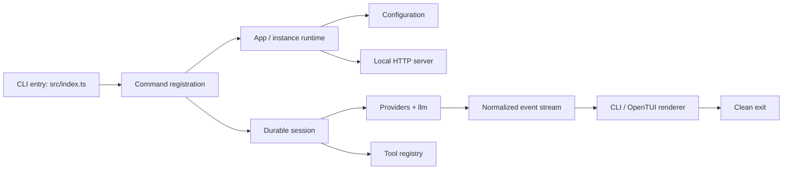
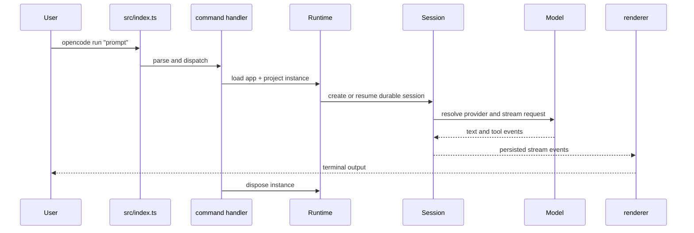
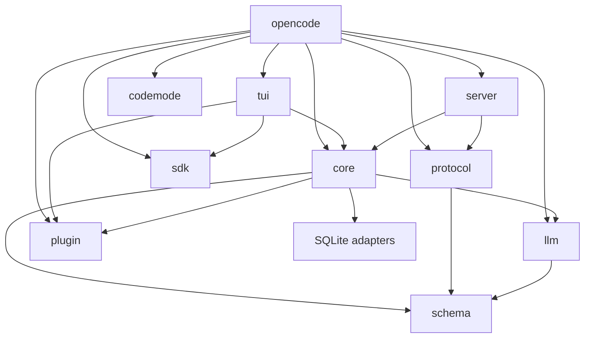

# Athena CLI Foundation

## Project Overview

This is the CLI-only OpenCode runtime retained as the baseline for later Athena work. It provides command parsing, configuration, local state, sessions, providers, tools, streaming, the terminal renderer, and a local HTTP control surface. Athena features are intentionally out of scope.

The runtime is TypeScript executed and compiled by Bun 1.3.14; it is not a Go application.

## Architecture

`packages/opencode` is the composition root. Its commands use the location-scoped runtime, which loads configuration and durable state, starts the local server when needed, and exposes it through the SDK client. Provider requests are normalized by `llm`; session events drive both persistence and terminal output.



## Repository Structure

```text
packages/
  opencode/                 Core CLI, commands, configuration, sessions, tools, local server
  core/                     Durable state, filesystem, providers, project and runtime primitives
  tui/                      OpenTUI renderer and terminal interaction runtime
  server/                   Local HTTP API control surface
  protocol/                 Shared HTTP API contracts
  schema/                   Shared schemas
  llm/                      Provider transport and stream normalization
  plugin/                   Plugin and terminal-extension contracts
  codemode/                 Confined code-execution tool runtime
  sdk/js/                   Local API client
  effect-drizzle-sqlite/    SQLite Effect/Drizzle adapter
  effect-sqlite-node/       Node SQLite adapter
  script/                   Build metadata helpers
patches/                    Required third-party dependency patches
athena-migration/           Historical extraction reports
```

## CLI Flow



## Startup Flow

1. `packages/opencode/src/index.ts` registers yargs commands, flags, help, and version output.
2. `effectCmd` starts `AppRuntime`; commands needing project state load an `InstanceStore` context.
3. Configuration, plugins, models, storage, and tool registries are resolved in that context.
4. `run` starts or attaches to the local server, then creates or resumes a durable session.
5. The session processor resolves the model, executes tools, consumes one normalized provider stream, and emits terminal events.
6. The command disposes its instance; `serve` also stops its listener on SIGINT or SIGTERM before exiting.

## Configuration

Configuration resolves from the normal OpenCode locations. Inspect the effective config without plugins:

```sh
bun run --cwd packages/opencode src/index.ts --pure debug config
```

Use `--pure` for reproducible local diagnostics. Provider credentials may be configured through the supported provider commands or environment variables; never commit them.

## Commands

```sh
opencode --help
opencode --version
opencode debug config
opencode providers list
opencode models [provider]
opencode session list --format json
opencode run "Explain this repository"
opencode serve --hostname 127.0.0.1 --port 4096
```

`run` supports session resumption, JSON event output, file attachments, model selection, and tool execution. `serve` is the headless local control surface.

## Build

Install Bun 1.3.14 and dependencies:

```sh
bun install
bun run typecheck
bun run build
```

The build compiles the current-platform binary to `packages/opencode/dist/` and smoke-tests its version command.

## Run

During development:

```sh
bun run dev -- --help
bun run --cwd packages/opencode dev -- --pure run "Hello"
```

Run the built binary directly:

```sh
./packages/opencode/dist/opencode-darwin-arm64/bin/opencode --help
```

The binary directory is platform-specific.

## Debug

```sh
opencode debug info
opencode debug paths
opencode debug config
opencode --print-logs --log-level DEBUG run "diagnose startup"
```

## Development Workflow

Run type checks from the affected package, never from the repository root:

```sh
bun run --cwd packages/opencode typecheck
bun run --cwd packages/core typecheck
```

After a public Protocol or Server HttpApi change, run `bun run generate` from `packages/client` when that package is present. Regenerate the legacy JavaScript SDK with `./packages/sdk/js/script/build.ts` when its public API changes. Do not edit generated SDK source directly.

## Dependency Graph



All 13 workspace packages resolve through Bun's workspace installation. The workspace package graph has no package-to-package cycle. Provider SDK dependencies remain intentionally: provider selection is configuration-driven and cannot be proven unused from a single CLI startup path.

## Validation Report

Validated on 2026-08-05 with Bun 1.3.14:

- Forced workspace typecheck: 12 of 12 runnable package tasks passed.
- CLI source `--help`, compiled binary `--version`, configuration loading, credential/provider discovery, model command, and empty session listing passed.
- Current-platform production build passed, including its built-in binary smoke test.
- An isolated `run --format json` workflow created a durable session, initialized a configured provider, streamed events, ran built-in `grep` tools, persisted the session, and exited with status 0.
- An isolated `serve` workflow started on loopback and, after the shutdown repair, stopped its listener and exited with status 0 on SIGTERM.
- `bun pm ls` resolved all 13 workspace packages with no missing workspace dependency.

### Dead-Code Assessment

No source file was removed. The safe-removal standard requires proving a file is unimported, never executed through dynamic command/plugin/provider paths, unnecessary for compilation and configuration, and unnecessary to CLI validation. The retained command, provider, plugin, tool, server, and renderer code is dynamically reachable or cannot be proven otherwise; deleting it would be speculative.

## Known Limitations

- A real model turn requires configured credentials or an available authenticated provider. Validation uses the active configured provider; credentials are not stored in this repository.
- The repository intentionally has no in-tree test suite; validation is typecheck, production build, and CLI runtime smoke workflows.
- A module-level static scan reports legacy internal import cycles inside the retained runtime. The workspace package graph is acyclic. Removing those internal cycles would require broad architectural rewrites, which are outside this CLI-stabilization scope.
- This checkout has no `packages/client`, so no protocol code generation was required during this work.

## Future Athena Integration Points

| Athena system | Existing seam |
| --- | --- |
| Context Engine | `packages/core/src/system-context`, `packages/opencode/src/session/instruction.ts` |
| Memory | `packages/opencode/src/session` durable state and prompts |
| Planner | `packages/opencode/src/agent`, `packages/opencode/src/session/processor.ts` |
| Repository intelligence | `packages/core/src/project`, `packages/core/src/git`, `packages/opencode/src/lsp` |
| Verification | `packages/opencode/src/tool` and continuation handling |
| Model routing | `packages/opencode/src/session/llm.ts`, `packages/opencode/src/provider`, `packages/llm/src/route` |

These seams are retained but no Athena behavior is implemented here.
