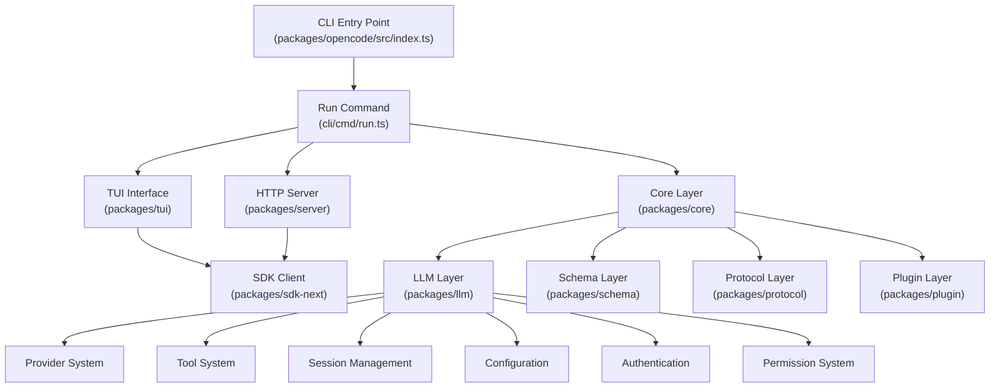
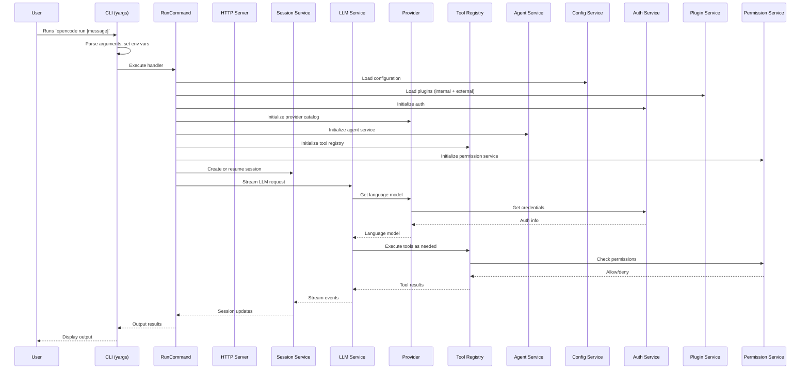

# OpenCode Documentation

OpenCode is an AI-powered development tool that provides an intelligent coding assistant with support for multiple LLM providers, tool execution, session management, and extensibility through plugins.

## Table of Contents

- [Architecture Overview](#architecture-overview)
- [Technology Stack](#technology-stack)
- [Repository Structure](#repository-structure)
- [Startup Flow](#startup-flow)
- [Runtime Flow](#runtime-flow)
- [Agent Lifecycle](#agent-lifecycle)
- [Context Lifecycle](#context-lifecycle)
- [Provider Architecture](#provider-architecture)
- [Tool Architecture](#tool-architecture)
- [Session Architecture](#session-architecture)
- [Configuration](#configuration)
- [Dependency Graph](#dependency-graph)
- [Design Patterns](#design-patterns)
- [Important Components](#important-components)
- [Key Interfaces](#key-interfaces)
- [Important Data Structures](#important-data-structures)
- [Common Workflows](#common-workflows)
- [Development Guide](#development-guide)
- [Build Guide](#build-guide)
- [Debugging Guide](#debugging-guide)
- [Troubleshooting](#troubleshooting)
- [Extension Guide](#extension-guide)
- [Frequently Asked Questions](#frequently-asked-questions)
- [Glossary](#glossary)
- [Architecture Decision Records](#architecture-decision-records)
- [Suggested Reading Order](#suggested-reading-order)

## Architecture Overview

OpenCode is a monorepo built on the [Effect](https://effect.website) TypeScript framework (v4). It follows a layered architecture with clear separation of concerns between the CLI entry point, the core runtime, the LLM provider abstraction, the session management system, and the plugin/tool infrastructure.

### High-Level Architecture



## Technology Stack

| Category | Technology |
|----------|-----------|
| Language | TypeScript (ES2022) |
| Runtime | Bun (primary), Node.js (compatibility) |
| Framework | Effect v4 (functional programming) |
| Build System | Bun + Turborepo |
| Package Manager | Bun |
| Database | SQLite (via Drizzle ORM) |
| HTTP | Hono (server), Effect HTTP |
| LLM SDK | AI SDK v6 |
| TUI | OpenTUI (SolidJS-based terminal UI) |
| CLI | Yargs |
| Auth | OpenAuth, OAuth2 |
| Testing | Bun test runner |
| Linting | Oxlint |
| Type Checking | tsgo (TypeScript Go compiler) |

## Repository Structure

```
opencode/
├── packages/
│   ├── opencode/          # Main CLI application
│   ├── core/              # Core runtime layer
│   ├── llm/               # LLM provider abstraction
│   ├── schema/            # Shared schema definitions
│   ├── protocol/          # Protocol definitions
│   ├── plugin/            # Plugin infrastructure
│   ├── server/            # HTTP server
│   ├── sdk/               # JavaScript SDK
│   ├── sdk-next/          # Next-gen SDK
│   ├── client/            # Generated client
│   ├── tui/               # Terminal UI
│   ├── app/               # Web app
│   ├── desktop/           # Desktop app
│   ├── console/           # Console app
│   ├── cli/               # CLI library
│   ├── codemode/          # Code mode integration
│   ├── containers/        # Container support
│   ├── docs/              # Documentation site
│   ├── effect-drizzle-sqlite/ # Effect + Drizzle + SQLite
│   ├── effect-sqlite-node/    # Effect SQLite node
│   ├── enterprise/        # Enterprise features
│   ├── function/          # Cloudflare Functions
│   ├── http-recorder/     # HTTP recording
│   ├── httpapi-codegen/   # HTTP API codegen
│   ├── identity/          # Identity management
│   ├── slack/             # Slack integration
│   ├── stats/             # Statistics
│   ├── storybook/         # Storybook
│   ├── ui/                # UI components
│   └── web/               # Web app
├── scripts/               # Build and utility scripts
├── infra/                 # Infrastructure as code
├── nix/                   # Nix configuration
│   └── patches/           # Nix patches
├── specs/                 # Specifications
├── artifacts/             # Build artifacts
├── github/                # GitHub integration
├── sdks/                  # SDKs
└── perf/                  # Performance benchmarks
```

## Startup Flow



## Runtime Flow

The runtime follows an Effect-based dependency injection pattern using Layers. Each service is defined as a `Context.Service` and composed into a Layer graph. The main entry point (`packages/opencode/src/index.ts`) uses yargs for CLI parsing, then delegates to the `RunCommand` handler which orchestrates the entire session lifecycle.

Key runtime characteristics:
- **Dependency Injection**: Effect's Layer system provides all services
- **Concurrency**: Effect fibers for async operations
- **Streaming**: AI SDK's `streamText` for LLM responses
- **Event System**: EventV2Bridge for cross-service communication
- **State Management**: InstanceState for process-local state, Database for persistence

## Agent Lifecycle

1. **Creation**: Agent defined in config or generated by the system
2. **Configuration**: Agent has name, description, mode (subagent/primary/all), model, prompt, tools, permissions
3. **Execution**: Agent receives user prompt, processes through LLM, executes tools
4. **Completion**: Agent produces final response, session updated
5. **Cleanup**: Background jobs cancelled, resources released

Agents support:
- **Subagents**: Lightweight agents with restricted permissions
- **Primary agents**: Full-access agents for main tasks
- **Custom agents**: User-defined agents via config
- **Generated agents**: AI-generated agents for specific tasks

## Context Lifecycle

1. **Construction**: System prompt built from environment info, references, MCP tools
2. **Repository Indexing**: AGENTS.md, CLAUDE.md, CONTEXT.md loaded
3. **Retrieval**: File-based context from project directory
4. **Compression**: Session compaction when context exceeds limits
5. **Prompt Generation**: System prompt + conversation history + tool definitions
6. **Memory Integration**: Session history used for context

## Provider Architecture

The provider system supports multiple LLM providers through a unified interface:

- **AI SDK Integration**: Uses `@ai-sdk/*` packages for provider implementations
- **Provider Catalog**: Dynamic model discovery from `models.dev`
- **Auth Management**: API keys, OAuth tokens, well-known auth
- **Model Routing**: Provider/model selection based on agent config
- **Streaming**: SSE-based streaming for real-time responses
- **Fallback**: Automatic fallback to AI SDK runtime if native runtime unavailable

Supported providers: OpenAI, Anthropic, Google, Azure, AWS Bedrock, Cloudflare, GitHub Copilot, OpenRouter, X.AI, and more.

## Tool Architecture

Tools are registered in a `ToolRegistry` and executed within the LLM stream:

- **Built-in Tools**: read, write, edit, glob, grep, shell, task, todo, plan, skill, LSP, websearch, webfetch, apply_patch
- **Plugin Tools**: Tools exposed by plugins
- **MCP Tools**: Tools from MCP servers (list_resources, read_resource)
- **Custom Tools**: User-defined tools via config or plugins

Tool execution flow:
1. LLM calls a tool
2. ToolRegistry resolves the tool definition
3. Tool.execute() runs with context (sessionID, abort, ask for permissions)
4. Result returned to LLM
5. Tool output truncated if too large

## Session Architecture

Sessions are the primary unit of conversation:

- **Creation**: `Session.create()` creates a new session with a unique ID
- **Persistence**: SQLite database via Drizzle ORM
- **History**: Messages stored with sequence numbers for ordering
- **Compaction**: Automatic context compression when exceeding token limits
- **Forking**: Sessions can be forked from existing sessions
- **Revert**: Sessions support reverting to a previous state
- **Sharing**: Sessions can be shared via URL
- **Archiving**: Sessions can be archived

Session V2 architecture (current):
- Durable prompt admission separate from model execution
- `SessionExecution` process-global and Session-ID based
- `SessionRunCoordinator` for same-Session resume coalescing
- Advisory wakes drain durable inbox rows only

## Configuration

Configuration is loaded from multiple sources with precedence:
1. Environment variables
2. `opencode.json` in project root
3. `~/.config/opencode/config.json` (global config)
4. Defaults

Key configuration options:
- `provider`: Default LLM provider settings
- `agent`: Agent definitions and defaults
- `tool`: Tool configuration
- `permission`: Permission rules
- `mcp`: MCP server configuration
- `experimental`: Feature flags

## Dependency Graph

```
packages/opencode (CLI)
  ├── @opencode-ai/core (runtime)
  │   ├── effect (Effect v4)
  │   ├── drizzle-orm (SQLite)
  │   └── @effect/* (Effect ecosystem)
  ├── @opencode-ai/llm (LLM abstraction)
  │   ├── ai (AI SDK v6)
  │   ├── @ai-sdk/* (Provider SDKs)
  │   └── @opencode-ai/schema
  ├── @opencode-ai/plugin (Plugin system)
  ├── @opencode-ai/schema (Shared schemas)
  ├── @opencode-ai/protocol (Protocol definitions)
  ├── @opencode-ai/server (HTTP server)
  └── @opencode-ai/sdk (Client SDK)
```

## Design Patterns

1. **Effect-based DI**: All services use Effect's Layer system for dependency injection
2. **Service Pattern**: Each major subsystem is a `Context.Service` with a `Layer`
3. **Schema-first**: Data structures defined with Effect Schema for validation
4. **Stream Processing**: LLM responses processed as Effect Streams
5. **Event Bridge**: Cross-service communication via EventV2Bridge
6. **Layer Composition**: Services composed via Layer graphs
7. **Functional Error Handling**: Errors as typed classes, not exceptions

## Important Components

| Component | File | Purpose |
|-----------|------|---------|
| RunCommand | `cli/cmd/run.ts` | Main CLI entry point for `opencode run` |
| Session.Service | `session/session.ts` | Session CRUD operations |
| SessionProcessor | `session/processor.ts` | Orchestrates LLM stream + tool execution |
| LLM.Service | `session/llm.ts` | LLM streaming with native/AI SDK runtimes |
| ToolRegistry | `tool/registry.ts` | Tool discovery and registration |
| Agent.Service | `agent/agent.ts` | Agent configuration and generation |
| Config.Service | `config/config.ts` | Configuration loading and merging |
| Auth.Service | `auth/index.ts` | Authentication credential management |
| Permission.Service | `permission/index.ts` | Permission evaluation and prompting |
| Plugin.Service | `plugin/index.ts` | Plugin loading and hook management |
| Provider.Service | `provider/provider.ts` | Provider model resolution |
| Server | `server/server.ts` | HTTP server for SDK/attach mode |

## Key Interfaces

### Session.Service
```typescript
interface Interface {
  readonly list: (input?: ListInput) => Effect.Effect<Info[]>
  readonly create: (input?: CreateInput) => Effect.Effect<Info>
  readonly fork: (input: { sessionID: SessionID; messageID?: MessageID }) => Effect.Effect<Info>
  readonly get: (id: SessionID) => Effect.Effect<Info, NotFound>
  readonly messages: (input: { sessionID: SessionID; limit?: number }) => Effect.Effect<WithParts[]>
  readonly remove: (sessionID: SessionID) => Effect.Effect<void>
  // ... more methods
}
```

### LLM.Service
```typescript
interface Interface {
  readonly stream: (input: StreamInput) => Stream.Stream<LLMEvent, unknown>
}
```

### ToolRegistry.Service
```typescript
interface Interface {
  readonly tools: (model: { providerID: ProviderV2.ID; modelID: ModelV2.ID; agent: Agent.Info; permission?: PermissionV1.Ruleset }) => Effect.Effect<Tool.Def[]>
  readonly ids: () => Effect.Effect<string[]>
  readonly all: () => Effect.Effect<Tool.Def[]>
}
```

## Important Data Structures

### Session.Info
```typescript
interface Info {
  id: SessionID
  slug: string
  projectID: ProjectV2.ID
  title: string
  agent?: string
  model?: { id: ModelV2.ID; providerID: ProviderV2.ID; variant: string }
  permission?: PermissionV1.Ruleset
  cost?: number
  tokens?: { input: number; output: number; reasoning: number; cache: { read: number; write: number } }
  time: { created: number; updated: number; compacting?: number; archived?: number }
  revert?: { messageID: MessageID; partID?: PartID; snapshot?: string; diff?: string }
  // ... more fields
}
```

### Tool.Def
```typescript
interface Def {
  id: string
  description: string
  parameters: Schema.Decoder<unknown>
  jsonSchema?: JSONSchema7
  execute(args: Schema.Schema.Type<Parameters>, ctx: Context): Effect.Effect<ExecuteResult>
  formatValidationError?(error: unknown): string
}
```

## Common Workflows

### Running a Session
1. User runs `opencode run "fix the bug"`
2. CLI parses arguments, loads config
3. Plugin system initializes (internal + external plugins)
4. Session created or resumed
5. Agent selected (from config or default)
6. Model resolved from catalog
7. LLM stream initiated with system prompt + conversation history
8. Tools executed as LLM calls them
9. Results streamed back to user
10. Session persisted to database

### Attaching to a Remote Server
1. User runs `opencode run --attach http://localhost:4096 "message"`
2. CLI creates SDK client pointing to remote server
3. Session created on remote server
4. Events streamed back via WebSocket
5. Interactive mode with TUI

### Using a Subagent
1. Agent config specifies `mode: "subagent"`
2. Subagent gets restricted permissions
3. Subagent runs within parent session
4. Results reported back to parent

## Development Guide

### Prerequisites
- Bun 1.3.14+
- Node.js 22+ (for some tooling)

### Setup
```bash
bun install
```

### Running the CLI
```bash
bun run dev  # Run opencode in dev mode
```

### Running Tests
```bash
cd packages/opencode
bun test
```

### Type Checking
```bash
cd packages/opencode
bun typecheck
```

### Linting
```bash
bun run lint
```

## Build Guide

```bash
# Build the main package
cd packages/opencode
bun run build

# Build the SDK
cd packages/sdk/js
bun run build.ts

# Regenerate client types (after Protocol/Server HttpApi changes)
cd packages/client
bun run generate
```

## Debugging Guide

- Use `--print-logs` flag to see logs on stderr
- Use `--log-level DEBUG` for verbose logging
- Use `--format json` for machine-readable output
- Use `--mini` for split-footer interactive mode
- Use `--attach` to connect to a running server

## Troubleshooting

### "Session not found"
- Check that the session ID is correct
- Verify the session exists in the database

### "Model unavailable"
- Check that the provider is configured
- Verify the model exists in the catalog
- Check authentication credentials

### Permission denied
- Check the permission ruleset for the agent
- Use `--auto` to auto-approve permissions (dangerous)
- Review the permission prompt and approve

## Extension Guide

### Writing a Plugin
Plugins are functions that return hooks:

```typescript
import type { Plugin } from "@opencode-ai/plugin"

export const MyPlugin: Plugin = (input) => ({
  hooks: {
    "tool.execute.before": async (input, output) => {
      // Called before tool execution
    },
    "tool.execute.after": async (input, output) => {
      // Called after tool execution
    },
  },
  tool: {
    myTool: {
      description: "My custom tool",
      parameters: { /* Zod schema */ },
      execute: async (args, ctx) => {
        return { title: "Done", output: "Result" }
      },
    },
  },
})
```

### Adding a Provider
1. Add the `@ai-sdk/*` package as a dependency
2. Register the provider in `packages/opencode/src/provider/provider.ts`
3. Add the provider to the bundled providers map
4. Configure auth method in `packages/opencode/src/auth/index.ts`

## Frequently Asked Questions

**Q: What is the difference between `--mini` and normal mode?**
A: `--mini` runs in split-footer interactive mode with a TUI, while normal mode streams output to the terminal.

**Q: How do I attach to a running OpenCode server?**
A: Use `opencode run --attach http://localhost:4096 "your message"`

**Q: How are sessions persisted?**
A: Sessions are stored in SQLite via Drizzle ORM in the `.opencode` directory.

**Q: Can I use custom tools?**
A: Yes, via plugins or by placing tool files in `{tool,tools}/*.ts` in your project directory.

**Q: How does the permission system work?**
A: Permissions are evaluated against a ruleset. Each tool call checks the ruleset and either allows, denies, or asks the user for approval.

## Glossary

| Term | Definition |
|------|-----------|
| Agent | A configured AI assistant with specific permissions, model, and prompt |
| Session | A conversation unit with a unique ID, containing messages and metadata |
| Tool | A function the LLM can call to perform actions (read, write, shell, etc.) |
| Provider | An LLM provider (OpenAI, Anthropic, etc.) |
| Plugin | An extension mechanism for adding tools, auth, and hooks |
| MCP | Model Context Protocol - external tool/resource servers |
| Layer | Effect's dependency injection unit |
| Service | Effect's Context-based service definition |
| Stream | Effect's streaming abstraction for LLM responses |
| Schema | Effect Schema for data validation and serialization |

## Architecture Decision Records

### ADR-001: Effect v4 for Runtime
**Status**: Accepted
**Context**: Need a functional programming framework for type-safe dependency injection and error handling.
**Decision**: Use Effect v4 for all runtime services.
**Consequences**: All services are Context-based, composable via Layers, errors are typed.

### ADR-002: SQLite for Persistence
**Status**: Accepted
**Context**: Need a lightweight, file-based database for session storage.
**Decision**: Use SQLite via Drizzle ORM.
**Consequences**: Single-file database, no server needed, portable.

### ADR-003: AI SDK for LLM Integration
**Status**: Accepted
**Context**: Need unified interface for multiple LLM providers.
**Decision**: Use AI SDK v6 for provider abstraction and streaming.
**Consequences**: Provider-agnostic LLM calls, streaming support, tool calling.

### ADR-004: Monorepo Structure
**Status**: Accepted
**Context**: Multiple packages with shared types and runtime.
**Decision**: Use Bun workspaces with Turborepo for build orchestration.
**Consequences**: Shared types, independent versioning, coordinated builds.

### ADR-005: V2 Session Architecture
**Status**: Accepted
**Context**: Need durable session management with process-local execution.
**Decision**: Separate prompt admission from model execution, use SessionExecution for process-local ownership.
**Consequences**: Durable sessions, process-local execution, advisory wake pattern.

## Suggested Reading Order

1. `packages/opencode/src/index.ts` - CLI entry point
2. `packages/opencode/src/cli/cmd/run.ts` - Run command handler
3. `packages/opencode/src/session/session.ts` - Session management
4. `packages/opencode/src/session/processor.ts` - Session processor (orchestrator)
5. `packages/opencode/src/session/llm.ts` - LLM streaming
6. `packages/opencode/src/session/tools.ts` - Tool resolution
7. `packages/opencode/src/provider/provider.ts` - Provider system
8. `packages/opencode/src/plugin/index.ts` - Plugin system
9. `packages/opencode/src/permission/index.ts` - Permission system
10. `packages/opencode/src/config/config.ts` - Configuration
11. `packages/core/src/session/execution/local.ts` - V2 session execution
12. `packages/core/src/session/runner/model.ts` - Model resolution
13. `packages/llm/src/index.ts` - LLM package overview
14. `packages/server/src/server.ts` - HTTP server
15. `packages/sdk-next/src/index.ts` - SDK client