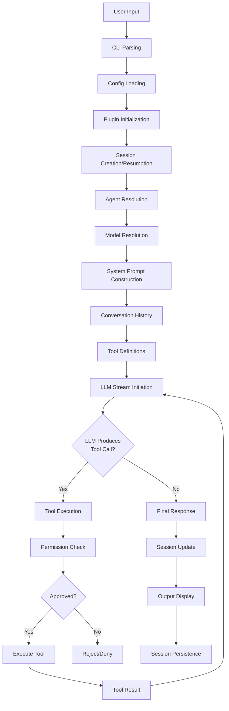

# Knowledge Flow

## Overview

The knowledge flow describes how information moves through the OpenCode system from user input to LLM response and back.

## Complete Data Flow



## System Prompt Construction

The system prompt is built from multiple sources:

1. **Environment Info**: Working directory, git status, platform, date
2. **References**: Project references from `.opencode/references/`
3. **MCP Tools**: Available MCP server tools and resources
4. **Agent Prompt**: Custom prompt from agent configuration
5. **Instruction Files**: AGENTS.md, CLAUDE.md from project directory
6. **Model-Specific Prompt**: Provider-specific prompt templates (anthropic.txt, gpt.txt, etc.)

## Conversation History

Messages are loaded from the database in sequence order:
1. System messages (from context epoch baseline)
2. User messages with their parts
3. Assistant messages with their parts
4. Tool results

During compaction:
- Older messages are summarized
- Compaction parts are inserted
- Recent messages are preserved in full

## Tool Execution Flow

```
1. LLM produces tool call in stream
2. SessionProcessor receives the tool call event
3. ToolRegistry.resolve() finds the tool definition
4. Permission.ask() checks if tool is allowed
5. If permission requires user input, prompt is shown
6. Tool.execute() runs with context
7. Result is returned to LLM
8. Tool output is truncated if too large
9. Session is updated with tool result
10. Process continues until LLM produces final response
```

## Error Recovery Flow

```
1. LLM stream error occurs
2. Retry logic checks if error is retryable
3. If retryable, retry with exponential backoff
4. If not retryable, error is surfaced to user
5. Session state is preserved
6. User can continue or restart
```

## Context Compression Flow

```
1. Check if context exceeds token limit
2. Identify messages eligible for compression
3. Generate summary of older messages
4. Create compaction part in message history
5. Preserve recent messages in full
6. Protect certain tools from truncation
7. Update context epoch baseline
```

## Key Files

| File | Purpose |
|------|---------|
| `packages/opencode/src/session/processor.ts` | Session processor orchestrator |
| `packages/opencode/src/session/system.ts` | System prompt builder |
| `packages/opencode/src/session/instruction.ts` | Instruction file loading |
| `packages/opencode/src/session/compaction.ts` | Session compaction |
| `packages/opencode/src/session/message-v2.ts` | Message V2 handling |
| `packages/opencode/src/session/tools.ts` | Tool resolution |
| `packages/opencode/src/session/retry.ts` | Retry logic |