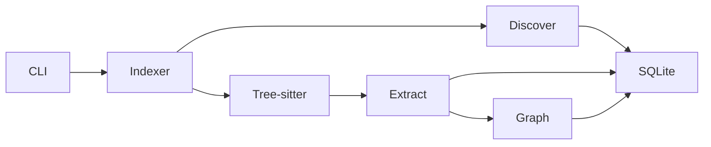
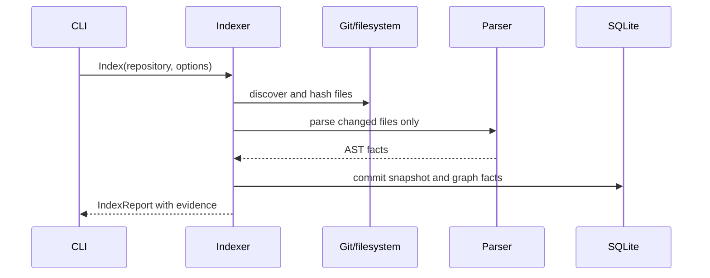

# Repository Intelligence Migration Dossier

## Current Architecture

OpenCode has project, git, filesystem, LSP, and tool modules in `packages/opencode/src/project`, `git`, `lsp`, and `tool`. They serve sessions and tools but do not provide a durable, versioned repository fact model, incremental AST index, import graph, call graph, or architecture detector.

## Athena Architecture

`athena/repository` owns repository discovery, content hashing, Tree-sitter parsing, symbol extraction, and durable facts. It emits immutable snapshots keyed by repository ID, Git revision, and index generation. Facts include files, languages, imports, symbols, references, dependencies, and detected architectural concepts.

## Comparison and Migration Risks

OpenCode exposes live project and tool views; Athena makes repository evidence durable and snapshot-scoped. Main risks are parser correctness across languages, index time on large worktrees, path escape through symlinks, and stale facts during concurrent edits. The migration mitigates them with read-only indexing, content hashes, explicit snapshot IDs, bounded concurrency, and parity fixtures before any context or execution consumer depends on the index.

## Public Interfaces

```text
RepositoryIndexer.Index(ctx, RepositoryRef, IndexOptions) (IndexReport, error)
RepositoryReader.Snapshot(ctx, RepositoryRef) (RepositorySnapshot, error)
RepositoryQuery.Symbols(ctx, SnapshotID, SymbolQuery) ([]Symbol, error)
RepositoryQuery.Impact(ctx, SnapshotID, ChangeSet) (ImpactReport, error)
```

`IndexOptions` bounds roots, ignored paths, concurrency, and incremental mode. Results always identify their snapshot and evidence locations.

## Internal Components

- `discover`: repository root, Git state, ignore rules, and file inventory.
- `parse`: Tree-sitter grammars and per-file AST extraction.
- `extract`: symbols, imports, exports, calls, tests, and architectural concepts.
- `graph`: import, dependency, and call graph construction.
- `store`: transactional SQLite persistence and content-addressed parse cache.

## Migration Strategy

First capability: an explicit CLI command that inventories a selected repository and persists file hashes only. It is read-only, independently useful, and establishes repository identity and incremental invalidation. Tree-sitter symbols follow only after hash-index correctness is verified.

## Milestone Status

- **Inventory (hash facts): implemented and reviewed.** `athena index` persists deterministic SHA-256 snapshots; see `reviews/01-repository-inventory.md`.
- **Symbol facts: implemented and reviewed.** `athena index --parse` extracts named declarations for Go, TypeScript/TSX, JavaScript, Python, Rust, Java, C, and C++ into durable `parses`/`symbols` rows; `athena symbols` queries the latest snapshot. See `reviews/02-tree-sitter-symbol-facts.md`.
- **Import facts: implemented and reviewed.** `athena index --parse` also extracts module/package/header references into durable `imports` rows; `athena imports` queries the latest snapshot. This is the durable-reference slice of the "qualified-type resolution and durable import/edge facts" increment; see `reviews/03-durable-imports.md`.
- **Import graph edges: implemented and reviewed.** Relative TS/JS and C-family include references resolve to same-snapshot files as durable `import_edges` rows; `athena edges` queries the latest snapshot. See `reviews/04-import-graph.md`.
- **Next increment:** qualified-type resolution and language-specific module resolution (Python `from .` relative, Rust `use`, Go `go.mod` module mapping), with its own dossier/implementation/verification/benchmark/review before it may be consumed.

## Dependency Graph



## Sequence Diagram



## Data Flow

Repository bytes → normalized path and hash → parse result → extracted facts → graph edges → SQLite snapshot. No model is involved in fact creation.

## Acceptance Criteria

- Re-indexing an unchanged repository parses zero files.
- Changed, renamed, deleted, ignored, symlink, and binary files produce deterministic reports.
- Every symbol and edge points to a snapshot, path, byte range, and source hash.

## Testing and Benchmark Strategy

Unit-test ignore and hash behavior; integration-test fixture repositories and Git transitions; fuzz parsers with malformed text. Benchmark cold and incremental indexing separately, reporting files/sec, bytes/sec, parse time, SQLite commit time, and peak memory on macOS.

## Documentation

Document supported languages, snapshot schema, ignored-path policy, invalidation semantics, and every query evidence field before exposing the CLI command.
