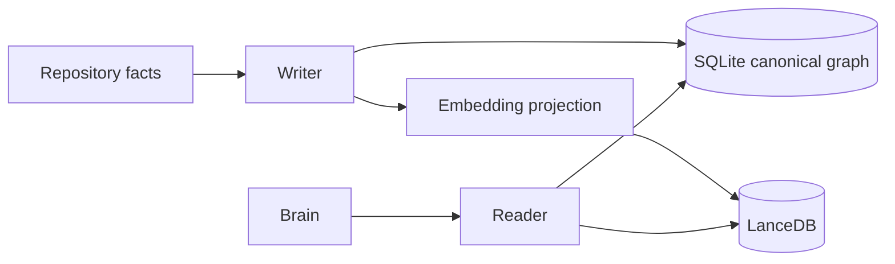
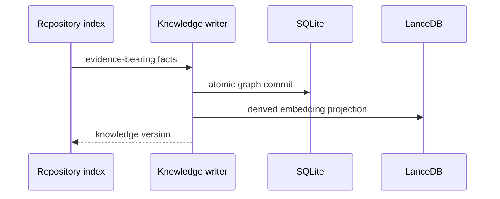

# Knowledge System Migration Dossier

## Current Architecture

OpenCode retains sessions, prompts, project metadata, and provider context. Its state is session-oriented; it does not maintain a canonical cross-session graph of repository facts, business concepts, decisions, and derived relationships.

## Athena Architecture

`athena/knowledge` owns a versioned evidence graph. SQLite stores nodes, typed edges, provenance, confidence, and decision records. LanceDB stores only embeddings for eligible text projections; embedding results must resolve back to SQLite evidence and cannot be used as facts.

## Comparison and Migration Risks

OpenCode session history is temporal and prompt-oriented; Athena knowledge is durable, typed, and source-addressable. Risks are ontology churn, graph growth, stale embedding projections, and accidental promotion of model inference to fact. Versioned transactions, evidence-only writes, derived-vector rebuilds, and schema migrations make these risks observable and reversible.

## Public Interfaces

```text
KnowledgeWriter.Commit(ctx, KnowledgeTransaction) (KnowledgeVersion, error)
KnowledgeReader.Neighborhood(ctx, SnapshotID, NodeID, Traversal) (EvidenceGraph, error)
KnowledgeReader.Search(ctx, SnapshotID, EvidenceQuery) ([]Evidence, error)
KnowledgeReader.Impact(ctx, SnapshotID, NodeID) (ImpactReport, error)
```

## Internal Components

- `ontology`: node and edge schemas for code, tests, concepts, decisions, and tasks.
- `provenance`: source range, extractor, timestamp, and confidence rules.
- `graphstore`: SQLite graph projections and transaction boundaries.
- `embedding`: LanceDB projection, model fingerprint, and rebuild queue.
- `crossref`: evidence-preserving graph traversal and impact analysis.

## Migration Strategy

First capability follows repository hash indexing: persist one `Repository` node and one `File` node per indexed file with provenance. Do not add embedding search before exact graph traversal and rebuild semantics exist.

## Dependency Graph



## Sequence Diagram



## Data Flow

Repository facts and approved decisions → validated graph transaction → SQLite knowledge version → optional embedding projection → evidence-ranked graph retrieval.

## Acceptance Criteria

- Every answerable relation retains source provenance and snapshot version.
- Deleting or changing source facts invalidates derived edges and embeddings deterministically.
- Graph queries return evidence before any inferred summary.

## Testing and Benchmark Strategy

Property-test graph transaction invariants, integration-test projection rebuilds, and test version isolation. Benchmark exact traversal, hybrid retrieval, projection throughput, storage size, and rebuild time on representative repositories.

## Documentation

Publish the ontology, provenance levels, confidence policy, embedding rebuild procedure, retention policy, and query contracts.
