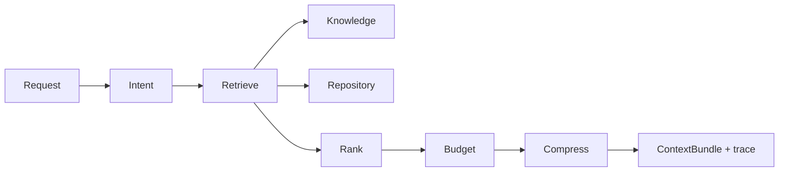
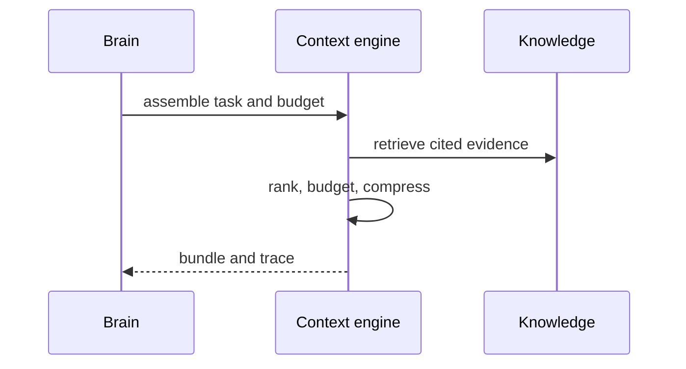

# Context Engine Migration Dossier

## Current Architecture

OpenCode builds model context from session history, configuration, tools, and prompts in `packages/opencode/src/session`. It lacks a durable evidence-ranking policy, explicit token budget allocation, and repository-snapshot-aware context contracts.

## Athena Architecture

`athena/context` transforms an approved intent and repository snapshot into an auditable `ContextBundle`. It ranks exact evidence, graph neighborhoods, historical decisions, and optional semantic retrieval; it compresses only after preserving citations and records every omission caused by budget limits.

## Comparison and Migration Risks

OpenCode context is assembled around active sessions and tool needs; Athena context is repository-snapshot-aware, evidence-ranked, and budget-accounted. Risks are retrieval regressions, oversized prompts, hidden compression loss, and model-specific token misestimation. Stable traces, golden corpora, deterministic ranking, and per-model budget adapters are required before replacing any prompt path.

## Public Interfaces

```text
ContextAssembler.Assemble(ctx, ContextRequest) (ContextBundle, error)
ContextExplainer.Explain(ctx, BundleID) (ContextTrace, error)
IntentClassifier.Classify(ctx, UserInput, SnapshotID) (Intent, error)
```

`ContextRequest` carries task, snapshot, token budget, permitted evidence classes, and model capabilities. `ContextBundle` contains content plus citations, token accounting, and retrieval trace.

## Internal Components

- `intent`: deterministic command intent and optional model-assisted classification.
- `retrieve`: exact path/symbol lookup, graph traversal, and semantic candidates.
- `rank`: evidence-first scoring and diversity constraints.
- `budget`: reserved slices for instructions, evidence, plans, and tool output.
- `compress`: structured summaries linked to source evidence.

## Migration Strategy

First capability consumes repository file facts only: exact path and symbol retrieval with a printed trace. It does not replace OpenCode prompt assembly until it can reproduce citations and bounded output.

## Dependency Graph



## Sequence Diagram



## Data Flow

Task and snapshot → intent → evidence candidates → ranked, budgeted citations → compressed bundle and trace. The context engine never edits files or persists unverified claims.

## Acceptance Criteria

- Every non-instruction claim in a bundle is cited or marked as a question.
- Token accounting never exceeds the request budget.
- Identical inputs and snapshot return stable rank ordering.

## Testing and Benchmark Strategy

Golden-test retrieval traces and citation preservation; property-test budget accounting; integration-test stale snapshot rejection. Benchmark retrieval latency, bundle utility against labeled tasks, citation recall, and compression ratio.

## Documentation

Document ranking policy, budget classes, trace schema, model capability mapping, and the no-evidence behavior.
