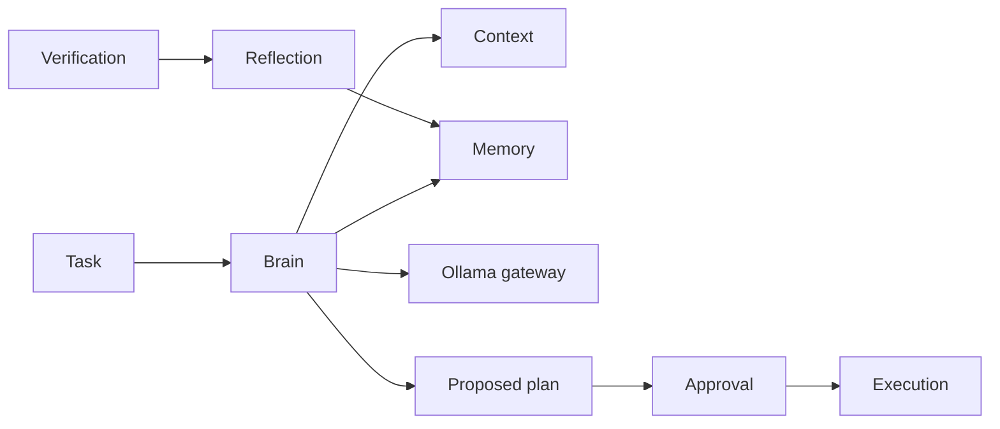
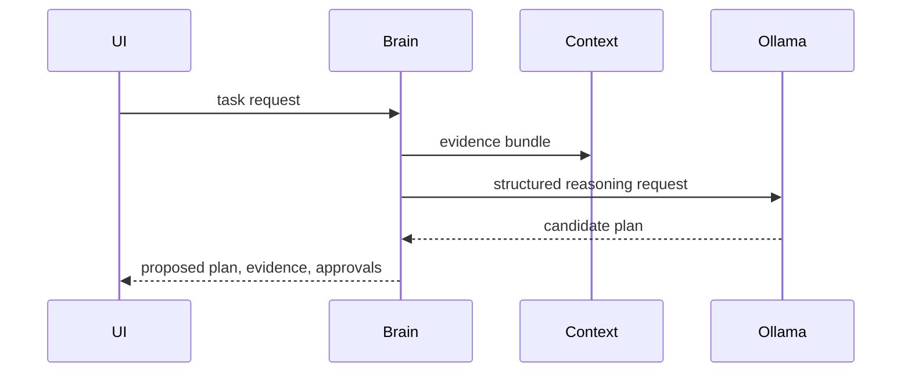

# Brain Migration Dossier

## Current Architecture

OpenCode agents, sessions, prompts, and provider execution are interleaved around an LLM turn. They can plan and invoke tools, but planning, memory, approval, reflection, and execution boundaries are not a separate Engineering Brain contract.

## Athena Architecture

`athena/brain` owns task interpretation, planning, working memory, decision records, model orchestration, and post-verification reflection. It produces proposed plans and never owns filesystem, Git, shell, or patch side effects.

## Comparison and Migration Risks

OpenCode combines agent reasoning and tool invocation in a session loop; Athena separates proposal, approval, execution, and learning. Risks are overconfident plans, unsafe memory retention, model schema drift, and loss of interactive responsiveness. Schema validation, evidence gates, scoped memory, local-model conformance tests, and streamed typed events constrain those risks.

## Public Interfaces

```text
Brain.Plan(ctx, TaskRequest) (ProposedPlan, error)
Brain.Decide(ctx, DecisionRequest) (Decision, error)
Brain.Reflect(ctx, CompletedTask) (Reflection, error)
Memory.Load(ctx, MemoryScope) (WorkingMemory, error)
Memory.Commit(ctx, MemoryUpdate) error
```

`ProposedPlan` contains steps, evidence, assumptions, required approvals, verification requirements, and rollback requirements. It is immutable after approval; changes create a new revision.

## Internal Components

- `planner`: task decomposition and dependency ordering.
- `reasoner`: model gateway orchestration and structured decision validation.
- `memory`: task-scoped working memory and approved long-term decisions.
- `policy`: confidence thresholds, evidence requirements, and approval gates.
- `reflection`: outcome comparison and preference proposals.

## Migration Strategy

First capability is read-only plan generation for a repository question. It emits a proposed plan and context trace but does not call execution. OpenCode session streaming can render this result through an adapter after contract parity is proven.

## Dependency Graph



## Sequence Diagram



## Data Flow

User task + evidence bundle + scoped memory → structured local model request → validated candidate → proposed plan → approval → verification outcome → reflection proposal.

## Acceptance Criteria

- Brain output never includes an applied change.
- Every plan step identifies evidence, permission, verification, and rollback requirements.
- Model output failing schema or evidence policy is rejected, not silently repaired.

## Testing and Benchmark Strategy

Use fake local model transport for deterministic unit tests and recorded Ollama responses for integration tests. Benchmark plan validity, evidence coverage, latency, token use, and reflection precision on a curated task corpus.

## Documentation

Document plan schema, approval states, memory scopes, reflection retention, model selection policy, and all decision trade-offs.
