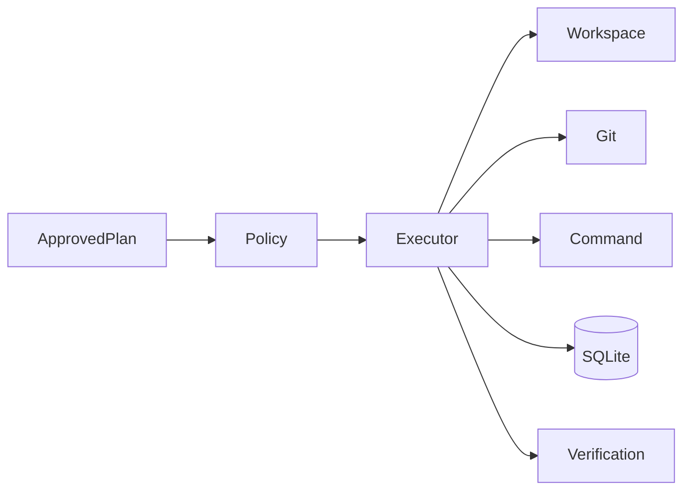
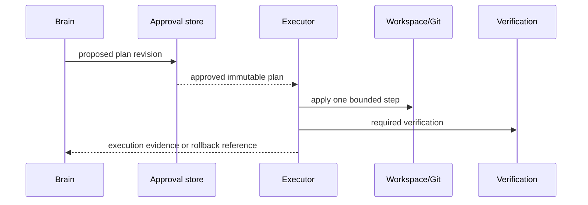

# Execution Migration Dossier

## Current Architecture

OpenCode tools in `packages/opencode/src/tool`, Git support, and shell/process primitives execute model-directed operations. Permission controls exist, but execution is coupled to session tool loops rather than an Athena-approved-plan boundary.

## Athena Architecture

`athena/execution` applies only approved `ExecutionPlan` steps. It exposes narrow adapters for files, Git, commands, and patches; it records preconditions, effects, stdout/stderr references, and rollback handles. It cannot ask a model to choose another action.

## Comparison and Migration Risks

OpenCode tools are session-directed and permission-controlled; Athena execution is plan-directed, journaled, and independently verifiable. Risks are permission bypass, partial writes, destructive rollback errors, and shell nondeterminism. Capability checks, atomic writes, real-Git fixtures, durable journals, and cancellation tests must pass before a mutating adapter is enabled.

## Public Interfaces

```text
Executor.Apply(ctx, ApprovedPlan) (ExecutionReport, error)
Executor.Rollback(ctx, RollbackRef) (RollbackReport, error)
WorkspaceReader.Read(ctx, ReadRequest) (ReadResult, error)
ApprovalStore.Approve(ctx, PlanRevision, Approver) (Approval, error)
```

## Internal Components

- `policy`: path allowlists, command allowlists, network denial, and approval checks.
- `workspace`: atomic file reads/writes and patch application.
- `git`: status, diff, branch, commit, and rollback primitives.
- `command`: subprocess invocation with bounded output and cancellation.
- `journal`: append-only execution evidence and rollback references.

## Migration Strategy

First capability is read-only workspace inspection under an approved read plan. It reuses no OpenCode mutating tool until approval records, journaling, and rollback semantics have passed tests.

## Dependency Graph



## Sequence Diagram



## Data Flow

Approved immutable plan → policy validation → one side effect → journal → mandatory verification → execution report or rollback. No direct UI-to-file or model-to-shell path exists.

## Acceptance Criteria

- Unapproved, stale, altered, or out-of-scope plans are rejected before side effects.
- Each mutating step has precondition evidence and a rollback strategy.
- Cancellation leaves a durable journal and a recoverable workspace state.

## Testing and Benchmark Strategy

Use temporary repositories and real Git, never mocks for workspace semantics. Test permission escapes, symlinks, concurrent changes, cancellation, and rollback. Benchmark patch latency, command overhead, journal throughput, and rollback success rate.

## Documentation

Document approval lifecycle, capability matrix, journal schema, rollback guarantees, command isolation, and failure recovery.
