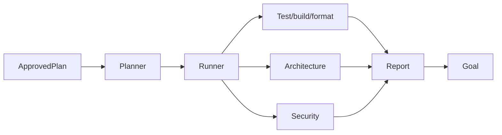
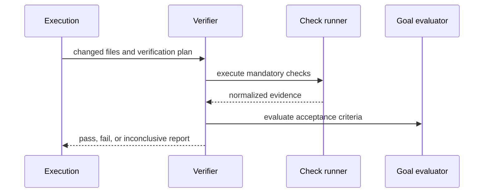

# Verification Migration Dossier

## Current Architecture

OpenCode can run tools and display results, while project commands decide their own checks. It does not define an Athena-level verification contract that binds an approved goal, change set, architecture policy, security policy, and completion state.

## Athena Architecture

`athena/verification` evaluates an immutable verification plan after every execution attempt. It runs build, test, format, static analysis, repository-policy, security, and goal checks; completion is impossible without a report that satisfies all mandatory gates.

## Comparison and Migration Risks

OpenCode can execute and display checks, while Athena makes their selection and completion semantics explicit. Risks are false passes from missing tools, expensive duplicate checks, flaky command output, and project-specific policy mismatch. `inconclusive` status, explicit environments, check deduplication, evidence capture, and repository-owned policy configuration prevent silent success.

## Public Interfaces

```text
Verifier.Verify(ctx, VerificationPlan) (VerificationReport, error)
PolicyEvaluator.Evaluate(ctx, EvidenceSet) (PolicyReport, error)
GoalEvaluator.Evaluate(ctx, Goal, EvidenceSet) (GoalReport, error)
```

## Internal Components

- `planner`: maps plan changes and repository policy to required checks.
- `runner`: bounded subprocess checks and normalized output capture.
- `architecture`: package-boundary and dependency-policy checks.
- `security`: secret, unsafe-command, and dependency-policy checks.
- `goal`: explicit acceptance-criterion evaluation with evidence links.

## Migration Strategy

First capability is a read-only verification report for the current repository: discover configured build/typecheck/test commands and execute only explicitly approved safe checks. It does not replace OpenCode’s existing build commands.

## Dependency Graph



## Sequence Diagram



## Data Flow

Approved requirements + actual changed files → selected checks → normalized evidence → policy and goal evaluation → immutable verification report.

## Acceptance Criteria

- A task cannot be marked complete without all required gates passing.
- Unavailable checks yield `inconclusive`, never a false pass.
- Reports identify commands, environment assumptions, exit codes, artifacts, and evidence paths.

## Testing and Benchmark Strategy

Test against fixture repositories with passing, failing, skipped, timed-out, and flaky commands. Benchmark plan construction, process concurrency, output storage, and full verification time by repository size.

## Documentation

Document verification statuses, check discovery, policy configuration, timeout rules, sandbox boundaries, and completion semantics.
