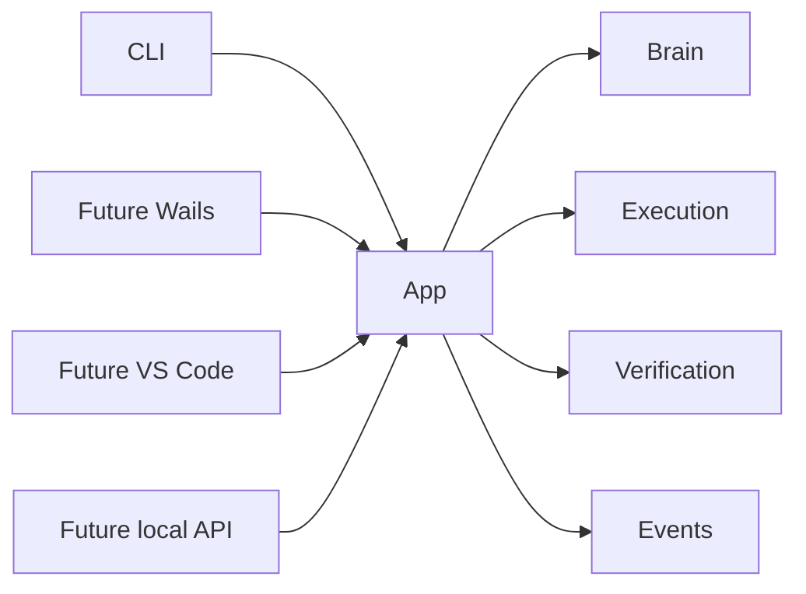
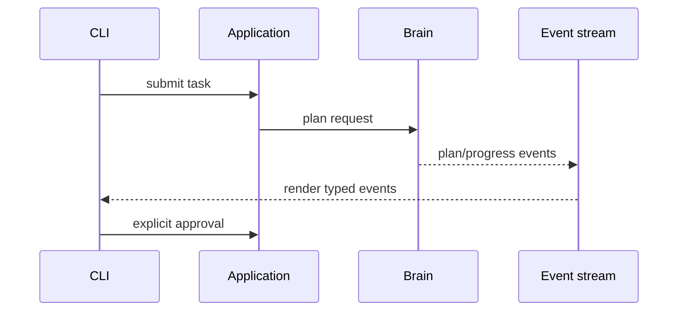

# User Interfaces Migration Dossier

## Current Architecture

OpenCode supplies a CLI, terminal renderer, sessions, local HTTP server, and SDK. It is optimized around a TypeScript/Bun application runtime; desktop and editor concerns would currently touch this runtime directly.

## Athena Architecture

`athena/app` is the interface-neutral application boundary. The initial Go CLI is one adapter. Future Wails desktop, VS Code, HTTP API, and voice adapters use the same task, plan, approval, execution, verification, and event contracts without importing Brain internals.

## Comparison and Migration Risks

OpenCode provides a mature terminal UI and local server; Athena requires stable, UI-neutral task contracts for multiple future adapters. Risks are incompatible event semantics, accidental UI authority, startup regression, and cross-language bridge complexity. Versioned events, contract tests, local-only transport, and a temporary adapter that does not own decisions contain those risks.

## Public Interfaces

```text
Application.Submit(ctx, TaskRequest) (TaskHandle, error)
Application.Events(ctx, TaskHandle) (<-chan Event, error)
Application.Approve(ctx, ApprovalRequest) (Approval, error)
Application.Status(ctx, TaskHandle) (TaskStatus, error)
```

Events are typed, ordered per task, resumable from a sequence number, and contain no UI formatting. Renderers own terminal, React, VS Code, or speech presentation.

## Internal Components

- `cli`: Cobra-style command adapter, configuration, structured output, and signal handling.
- `eventbus`: durable task events and reconnect cursor support.
- `presenter`: text, JSON, and future React view models.
- `opencode-adapter`: temporary bridge that renders Athena plans/events through existing OpenCode CLI facilities.
- `api`: future local-only transport boundary.

## Migration Strategy

First capability is the Athena Go CLI `athena doctor`, which reports local prerequisites without touching an OpenCode command. The next adapter can invoke repository hash indexing and render its report. Existing OpenCode CLI remains the default operational interface until parity is demonstrated.

## Dependency Graph



## Sequence Diagram



## Data Flow

Input adapter → validated task contract → application service → typed task events → presentation adapter. The UI has no filesystem, SQLite, LanceDB, or Ollama authority.

## Acceptance Criteria

- CLI output and JSON output are projections of the same event stream.
- A future UI can resume a task without accessing Brain internals.
- Signal cancellation is propagated through the application service and yields a durable final event.

## Testing and Benchmark Strategy

Contract-test all adapters against an in-process application fake; integration-test CLI cancellation and JSON stability. Benchmark startup time, event latency, rendering throughput, and memory use for long event streams.

## Documentation

Document command grammar, JSON schema, event ordering, cancellation, local transport authentication, and compatibility policy.
