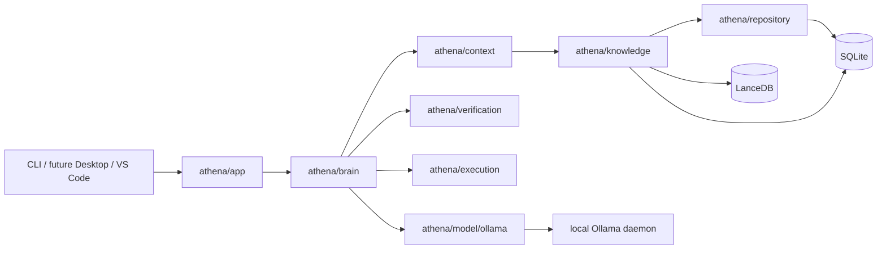

# Athena Architecture Decision Record

## Purpose

Athena is a local-first Engineering Brain. OpenCode remains a stable TypeScript/Bun CLI runtime during migration; Athena is a separate Go core whose decisions, knowledge, and execution approvals are interface-independent.

## Constraints and Decisions

| Decision | Rationale | Trade-off |
| --- | --- | --- |
| Go core in `athena/` | Long-lived, portable core with explicit concurrency and strong tooling | A cross-language bridge is required during migration |
| SQLite is the system of record | Durable, inspectable local state and transactional writes | Large-vector search is delegated |
| LanceDB stores embeddings only | Vector lookup augments, never replaces, evidence | A second local store must be kept in sync |
| Ollama is the only model gateway | No cloud API dependency; macOS local-first deployment | Capability and latency depend on installed local models |
| Interfaces are owned by Athena core | CLI, future Wails desktop, VS Code, API, and voice call the same contracts | UI work must not bypass the core |
| Execution is capability-limited | Brain proposes; execution applies approved plans | More explicit approval and audit plumbing |

## Target Topology

## Dependency Rules

- `domain` contains IDs, immutable records, and errors; it imports no Athena subsystem.
- `repository`, `knowledge`, `context`, `brain`, `execution`, and `verification` depend only on `domain` plus their declared lower-layer interfaces.
- UI adapters depend on `app` contracts only. They never write SQLite, call Ollama, or modify repositories directly.
- `execution` receives an approved plan and evidence requirements; it does not select goals, tools, or files.
- SQLite remains canonical. LanceDB records are derived and can be rebuilt.

## Migration Control

Each capability moves through: current-system analysis, Athena contract, one adapter, parity verification, benchmark, independent review, and documentation. No OpenCode subsystem is deleted until its Athena replacement is the default path and rollback has been tested.

## Deployment Prerequisites

- macOS on Apple Silicon or Intel, Go toolchain, Git, and SQLite.
- Running local Ollama daemon with an approved coding model and embedding model. At this review, the Ollama client is installed but its daemon is not running.
- Repository access is explicit; Athena never indexes outside selected roots.

