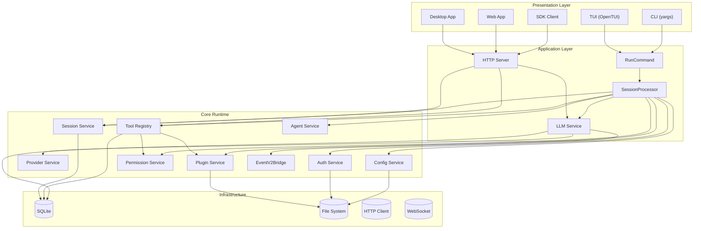
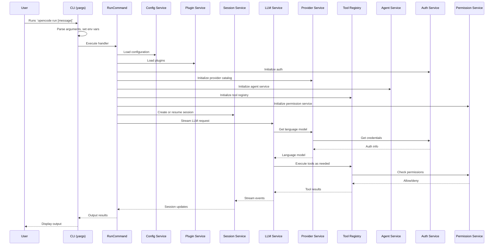
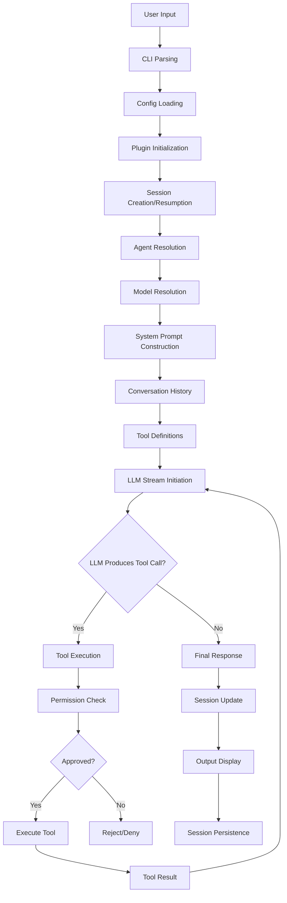
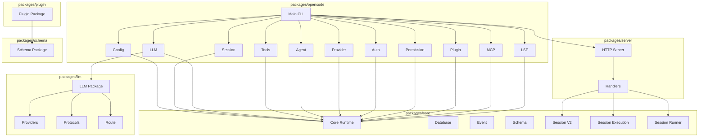
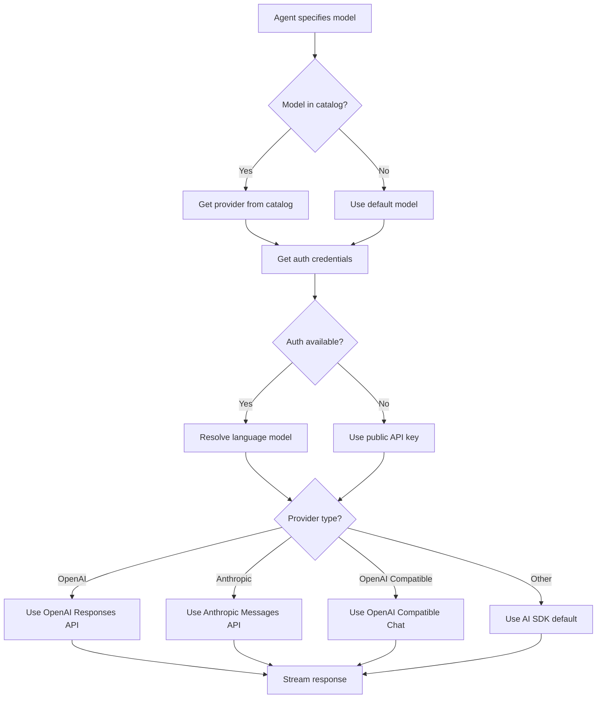
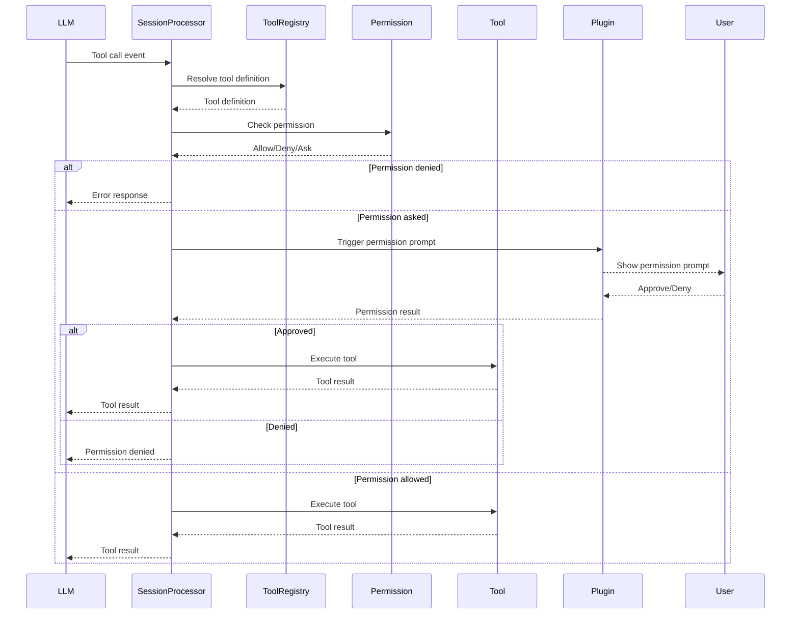
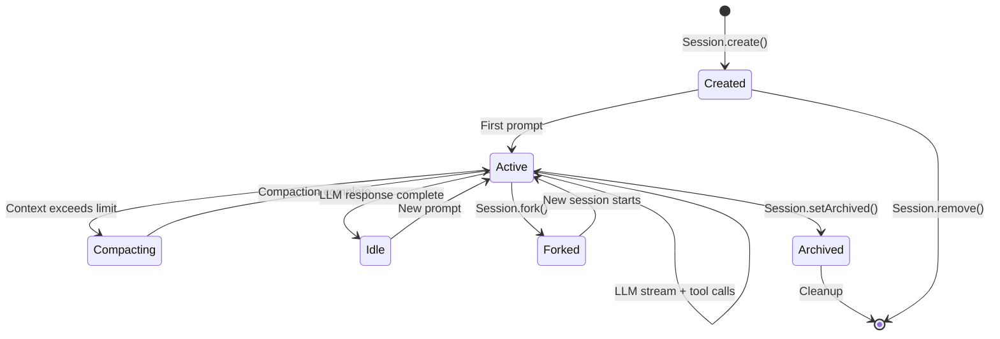
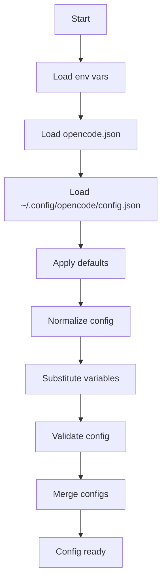
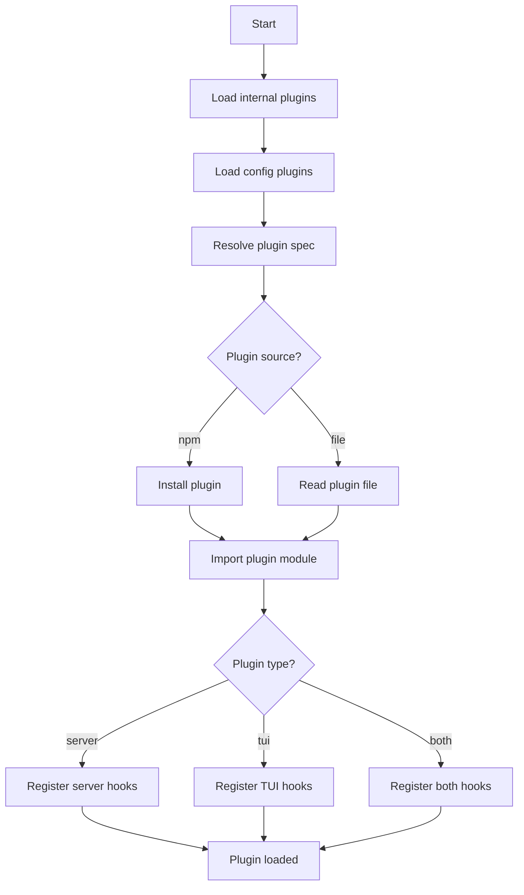

# Architecture Diagrams

## System Architecture

## Startup Sequence

## Runtime Flow

## Module Relationships

## Provider Selection Flow

## Tool Execution Flow

## Session Lifecycle

## Configuration Flow

## Plugin Loading Flow

